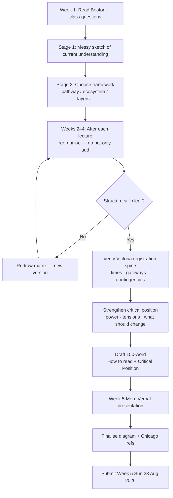
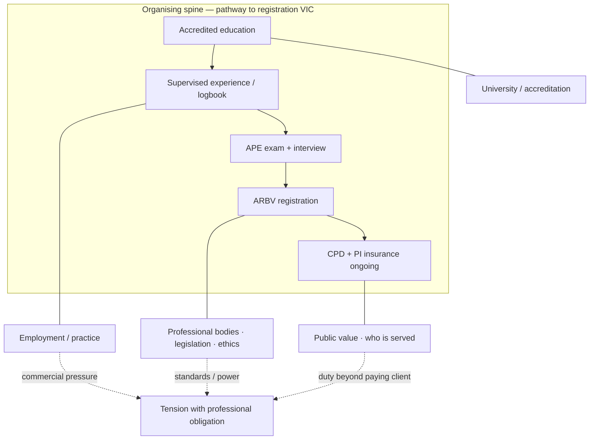

# Diagram: Assessment 1 process — Week 1 to submission

- **Purpose:** Ordered process to produce the Disciplinary Matrix + 150-word critical note
- **Source(s):** Assessment 1 brief; Week 1 Beaton + class questions
- **Date:** 2026-07-26
- **Type:** flowchart

## A. Submission process

## B. What the matrix itself should contain (starter layout)

## How to read this

1. Diagram **A** is your **work process** to get the assignment done.  
2. Diagram **B** is a **starter content layout** for the disciplinary matrix — replace placeholders with your research and critical arrows.  
3. Assessment rewards **relationships and critique**, not graphic polish or max entities.

## Notes

- Keep versions (`v01`, `v02`…) — thought process is part of the task.  
- Beaton PDF is already in `03-weekly-resources/week-01/`.  
- Confirm exact AACA/ARBV pathway details before final submission.
