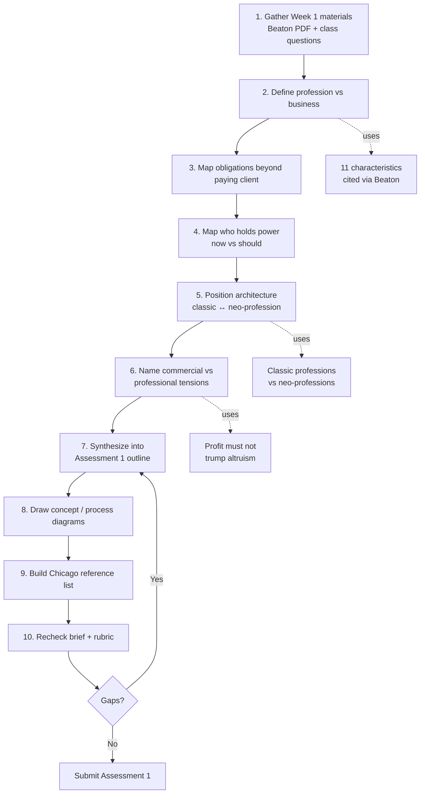
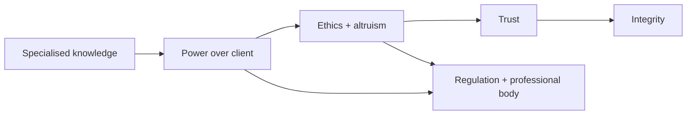

# Diagram: Week 1 → Assessment 1 process

- **Purpose:** Ordered process from Week 1 professionalism inquiry to Assessment 1 submission
- **Source(s):** `03-weekly-resources/week-01/`, `05-diagrams/assessment-1-process-prep.md`
- **Date:** 2026-07-26
- **Type:** flowchart

## Diagram

## How to read this

1. Top path (1→10) is your **submission process** — do these in order.
2. Dotted side notes are **theory anchors** from Beaton to drop into Assessment 1 writing.
3. The loop at stage 10 means: if the rubric check finds gaps, return to outline/synthesis — do not submit yet.

## Optional second diagram — concept spine

## Notes / assumptions

- Assessment 1 official brief not yet filed — insert due dates/word limits when you add it.
- Adapt stage names to match your unit’s Assessment 1 wording (e.g. reflective essay, poster, portfolio).
