# 01 — Diagram: Assessment 1 — The Disciplinary Matrix of Architecture ("ARCHITECTLAND")

- **Assessment:** 02-assessment-tasks/assessment-1-brief.md — A1 Disciplinary Matrix + 150-word critical position
- **Date:** 2026-08-16
- **Layout:** hybrid, composite-layered (see `08-diagram-style/STYLE_GUIDE.md`) — every required topic is its own "land" with its own native layout type, cross-linked by a "monorail" of relationship arrows. This file is the **thinking draft** (Mermaid) — see "Translating to the hand-drawn A1" below for how it becomes the actual submission.
- **Sources scoped:** the `05-diagrams/synthesis/01-master-map.md` v03 (Weeks 1–4), the Week 5 pre-readings (`03-weekly-resources/week-05/`), `02-assessment-tasks/procurement-research-note.md` (tagged independent research), and a tutorial whiteboard capture (Trust/Risk + NSCA project-stage process, photographed by the student, added 2026-08-16 — see `04-topics-context.md` for the transcription and flagged ambiguities). No new unsourced claims are introduced here — every node traces to one of those.
- **Theme:** structural park-map overlay, per tutor guidance (Week 3/4 tutorial) that a subway/train-map metaphor read as flat — reskinned as a theme park (Disneyland-style zoned "lands" + a flagship thrill-ride spine), because a park map is organised the way this brief actually asks you to organise: one legible spine (the ride to registration) plus themed zones that all connect back to a shared hub, with the *operators behind the scenes* as a distinct, deliberately less visible layer — which is exactly this diagram's critical position (see `02-explanation.md`).

## Legend — Park Map Key

| Element | Meaning |
|---------|---------|
| 🟡 Land / main node | Required Assessment 1 topic cluster |
| ⬜ Attraction / expansion | Short-form detail inside a land |
| 🟢 Integrated | Named theorist, case, or cross-week thread from the synthesis map |
| 🔵 New wing | Procurement Annex — independent research, not lecture-sourced (tagged) |
| 🔴 Backstage | Power/critical-position cluster — deliberately drawn as less visible than the rest |
| **→** solid black | Monorail route / primary flow (enables, depends upon) |
| **- - →** dashed | Relationship / influence (limits, causes) |
| **···→** dotted | Feedback loop |
| 🎢 | Registration Mountain — the flagship ride (the required organising spine) |
| 🚧 | Gate / turnstile — a real competency or legal checkpoint, not decoration |
| ⚠️ | Entrance / warning signage — what a ride is actually testing or risking (Trust, Risk) |

**Monorail link categories** (the cross-land relationship labels are prefixed with one of these — a safe stand-in for coloured line *strokes*: this diagram has 130+ edges, and Mermaid's line-colouring needs an exact numeric index per edge counted across the whole file — one miscount silently recolours the wrong link rather than erroring, so labels carry the colour instead):

| Marker | Category | Covers |
|--------|----------|--------|
| 🟡 spine | Required-topic backbone | Hub → Registration Mountain → each required land (education, employment, legislation, professional bodies) |
| 🟢 regulation/knowledge | Codes, standards, competencies, research | Regulation Row ↔ Guild Quarter ↔ Town Hall ↔ Innovation Pavilion, and the Project Flume's regulatory gates |
| 🔵 practice/procurement | What happens once you're working | Practice Square ↔ Procurement Annex ↔ The Project Flume |
| 🔴 critical position | Power, critique, backstage | Registration Mountain / Regulation Row / Procurement Annex → Control Booth, and back to the hub question |

**Layout type per zone**: HUB = radial; RIDE (Registration Mountain) = linear process with gated stations, entrance signage, and re-queue loops; APPRENTICELAND (education) = hierarchy; PRACTICE SQUARE (employment) = network, with THE PROJECT FLUME nested inside it as a small linear/iterative sub-ride; REGULATION ROW (legislation) = top-down; GUILD QUARTER (professional bodies) = list-network; TOWN HALL (ethics + public value) = radial; INNOVATION PAVILION (research/innovation) = left→right timeline; PROCUREMENT ANNEX = small linear, drawn attached by an unfinished bridge; BACKSTAGE (power/critique) = top-down hierarchy, visually behind everything else. Cross-links (the monorail) are relationship claims, not one uniform flow, per `08-diagram-style/STYLE_GUIDE.md` "Composite layering."

---

## Diagram

```mermaid
flowchart TB
  classDef default fill:#ffffff,color:#1a1a1a,stroke:#999999,stroke-width:1px;
  classDef main fill:#F4D35E,color:#1a1a1a,stroke:#8a6c1f,stroke-width:1px;
  classDef theory fill:#8FBF8F,color:#1a1a1a,stroke:#3f5a3f,stroke-width:1px;
  classDef transform fill:#9EC1D9,color:#1a1a1a,stroke:#345070,stroke-width:1px;
  classDef backstage fill:#E07A5F,color:#1a1a1a,stroke:#7a3b28,stroke-width:1px;
  classDef gate fill:#ffffff,color:#1a1a1a,stroke:#8a6c1f,stroke-width:2px,stroke-dasharray: 3 2;

  subgraph LEGEND["Park Map Key — node colour"]
    direction LR
    K1[🟡 Land] --- K2[⬜ Attraction]
    K2 --- K3[🟢 Integrated / theory]
    K3 --- K4[🔵 New wing]
    K4 --- K5[🔴 Backstage]
  end

  subgraph LINELEGEND["Park Map Key — lines + monorail markers"]
    direction LR
    LL1[Primary] -->|enables / depends upon| LL2[Flow]
    LL3[Relates] -.->|limits / causes / feedback| LL4[Influence]
    LL5["🟡 spine · 🟢 regulation/knowledge · 🔵 practice/procurement · 🔴 critical position — monorail label prefix, see cross-land links"]
  end
  LEGEND --- LINELEGEND

  subgraph HUB["🟡 MAIN STREET, AU — the park entrance [radial hub]"]
    direction LR
    HQ{"What does it take to be\ntrusted with the title\n'Architect' — and trusted\nby whom, for what?"}
    HQ1["Ticket booth: registration is\nthe ONE compulsory ride —\neverything else in the park\nis optional, but shapes what\nthat ride is actually worth"]
    HQ --> HQ1
  end
  class HQ main

  subgraph RIDE["🎢 REGISTRATION MOUNTAIN — Victoria's path to Architect [linear, gated]"]
    direction LR
    RSIGN1["⚠️ Entrance sign — TRUST:\nAutonomy · Discretion ·\nAccountability. Every station\non this ride tests one of\nthese three, not just\n'knowledge' (tutorial whiteboard)"]
    RSIGN2["⚠️ Entrance sign — RISK: owed\nto the PUBLIC and to the\nPROFESSION. More knowledge +\nexperience = more risk you're\ntrusted to carry (tutorial\nwhiteboard — see 04-topics-\ncontext.md for a reading note)"]
    RS1["🚧 Station 1: Accredited\neducation (AQF Part 1/2)"]
    RS2["🚧 Station 2: Supervised\nexperience — logbook,\n3,300 hrs / 35 competencies"]
    RS3["🚧 Station 3: APE — National\nExam (80 MCQ) + interview\n(45-60min, probes gaps)"]
    RS4["🚧 Station 4: ARBV\nregistration granted"]
    RS5["Station 5: CPD + PI\ninsurance — the ride never\nfully ends, it loops"]
    RQ1["Re-queue loop: fail/repeat\nexam, incomplete hours,\ninterstate/overseas mutual\nrecognition — sent back,\nnot ejected"]
    RQ2["🔴 Ejected from the park:\nTribunal finding, discipline\nregister, loss of title"]
    RSIGN1 -.-> RS1
    RSIGN2 -.-> RS1
    RS1 -->|depends upon| RS2 -->|depends upon| RS3 -->|enables| RS4 -->|enables| RS5
    RS3 -.->|limits — fail a gate| RQ1 -.->|re-attempt| RS3
    RS5 -.->|causes, on serious breach| RQ2
    RS5 -->|feeds back into| RS5
  end
  class RS1,RS3,RS4 main
  class RQ2 backstage
  class RSIGN1,RSIGN2 gate

  subgraph APPRENTICELAND["🟡 APPRENTICELAND — education (incl. CPD) [hierarchy]"]
    E1[University / accredited course\n— AQF-governed]
    E2[Graduation → eligible for\nlogbook stage]
    E3[CPD — only mandated\nARBV-wide since ~2022]
    E4["Molander: CPD is a FORMATIVE\nepistemic measure — builds\njudgment before it's tested"]
    E1 --> E2
    E2 -.->|feeds| RS1
    E3 -.->|feeds| RS5
    E4 -.-> E3
  end
  class E1 main
  class E4 theory

  subgraph PRACTICE["🟡 PRACTICE SQUARE — employment [network]"]
    P1[Practice / firm — where\nlogged hours are earned]
    P2["Project management — ceded\nby the profession in the\n1960s-70s, now a separate,\nmore lucrative field (Week 4)"]
    P3["ACA — business, procurement,\nemployment conditions"]
    P4[Professionals Australia\n— union]
    P1 -.->|depends upon| RS2
    P1 -.->|limits, if scope ceded| P2
    P3 -.-> P1
    P4 -.-> P1
  end
  class P1 main

  subgraph FLUME["⬜ THE PROJECT FLUME — a small ride inside Practice Square, run once per project [linear, gated, iterative — tutorial whiteboard]"]
    direction LR
    F0["Client + Stakeholders\n→ the Brief"]
    F1["Feasibility (F)"]
    F2["Concept / Sketch\nDesign (SK)"]
    F3["Developed\nDesign (DD)"]
    F4["Construction\nDocumentation (CD)"]
    F5["Contract\nAdministration (CA)"]
    F6["🚧 Gate: Town Planning\n(Council) approval"]
    F7["🚧 Gate: Building\nSurveyor (BS) sign-off"]
    F8["NSCA competencies span\nBOTH the design process\nAND contract administration\n— not just design skill"]
    F0 -->|depends upon| F1 -->|depends upon| F2 -->|depends upon| F3 -->|depends upon| F4 -->|depends upon| F5
    F2 -.->|limits, until approved| F6
    F4 -.->|limits, until signed off| F7
    F6 & F7 -.->|feeds back into,\nride is a loop not\na straight line| F0
    F8 -.-> F1
    F8 -.-> F5
  end
  class F1,F4 main
  class F8 theory
  PRACTICE -.->|🔵 practice/procurement,\nevery project runs this loop| FLUME
  FLUME -.->|🟢 regulation/knowledge,\nCouncil + Building\nSurveyor are REGULATION\nROW's checkpoints,\nplaying out project by\nproject| REGULATION
  RS2 -.->|🔵 practice/procurement,\nsame 35 NSCA\ncompetencies, tested here\nin the abstract and\nthere in practice| F8

  subgraph REGULATION["🟡 REGULATION ROW — legislation [top-down]"]
    L1[Architects Act 1991\n+ Regulations]
    L2[Building Act / VBA]
    L3["National Construction Code —\namendable (see INNOVATION\nPAVILION, Dan Hill roadmap)"]
    L4[Planning and Environment Act\n/ OVGA / DELWP-VPA]
    L5["Duty to public (s.17-18) +\nduty to resign a contract\nrather than breach the Act\n(fire-isolated-stair case)"]
    L1 --> L5
    L1 -.->|enables| RS4
    L2 & L3 & L4 -.->|constrain, alongside L1| RS4
  end
  class L1,L5 main

  subgraph GUILD["🟡 GUILD QUARTER — professional bodies [list-network]"]
    G1[AIA — voluntary,\nadvances the discipline]
    G2[ARBV — statutory,\npublic accountability]
    G3[AACA — national competency\nstandard, coordinates boards]
    G4["Parlour · ArchiTeam ·\nArchitects Declare · AASA —\nfill gaps AIA alone can't cover"]
    G5["Bates Smart Award, AIA\ncategories — the RECOGNITION\nmachinery, distinct from G2's\nREGULATION machinery (Week 4)"]
    G1 -.->|contrast| G2
    G4 -.-> G1
    G1 --> G5
  end
  class G1,G2 main

  subgraph TOWNHALL["🟡 TOWN HALL — ethics/codes + who the park serves [radial]"]
    T1["Duty beyond the paying\nclient — future occupants,\nneighbours, the public"]
    T2["Loos 1910: before God, no\ngood or bad architects — a\nmatter of degree, not kind"]
    T3["Bailey/Shaw/Bruhn: 'Architecture,\nnot Architects' — recognition\nshould serve public value, not\nmanufacture individual reputation"]
    T4["Stead: searchlight or lantern?\nDoes the profession's own record\nreflect the public it serves?"]
    T1 --> T2 --> T3 --> T4
    T4 -.->|the real test for every\nland in this park| HQ
  end
  class T1,T3 main

  subgraph INNOVATION["🟡 INNOVATION PAVILION — research + innovation [timeline]"]
    direction LR
    N1["What architecture IS (fit for\npurpose) vs what it DOES\n(performance) — Week 4"]
    N2["Lui: building codes are a site\nof CO-AUTHORSHIP — gender-\ninclusive bathrooms (2018),\npost-Triangle Fire egress\nrules (1911), ADA accessibility,\ndesegregation (1958-73) all\nchanged codes through activism"]
    N3["Dan Hill: 200,000 homes/yr at\ncurrent practice = 200% of\nAustralia's whole emissions\nbudget — Roadmap proposes\ncascading NCC emissions limits,\n461.8 → 6.63 kgCO2e/m²·a by 2028"]
    N4["'Fire, Water, Building'\nexhibition — 13 practices\nreframe fire/water from pure\nrisk-aversion toward\necologically-attuned design"]
    N1 --> N2 --> N3 --> N4
    N2 -.->|codes are amendable —\nby whoever shows up| REGULATION
    N3 -.->|proposes changing L3\ndirectly| L3
  end
  class N2,N3 theory

  subgraph PROCUREMENT["🔵 PROCUREMENT ANNEX — new wing, bridge unfinished [small linear]"]
    U1["🔵 Traditional (AS4000) vs\nDesign & Construct (AS4902)\nvs Novated D&C"]
    U2["🔵 AIA National Novation\nSurvey 2019: 266 practices,\n484 novated projects —\n'enormous opportunity to\naddress building quality\nand prevent risk'"]
    U3["🔵 Novation can diminish design\nintent — lost direct client\ncontact, restricted site access,\nexcluded from value management"]
    U4["🔵 A registered architect can\nlose creative control WITHOUT\nlosing registration — a\ndifferent kind of vulnerability\nthan anything on the ride"]
    U1 --> U2 --> U3 --> U4
  end
  class U1,U4 transform

  subgraph BACKSTAGE["🔴 CONTROL BOOTH — who actually operates the park [keyword network, drawn behind everything else]"]
    direction TB
    BS1[SCHOOLS]
    BS2[INSTITUTE]
    BS3[BOARD]
    BSAME["same overlapping group\n(Week 4, 'TheyRule' pattern)"]
    BREG["REGISTRATION\ntightly gated —\n5 reqs · 3 pathways · 3-part exam"]
    BCODE["CODE + CONTRACT\nloosely gated —\namendable by whoever shows up (Lui);\nnovated away by contract (U3-U4)"]
    B4{"= CRITICAL POSITION"}
    BS1 & BS2 & BS3 --> BSAME
    BSAME --> BREG
    BSAME --> BCODE
    BREG -.->|≠| BCODE
    BREG --> B4
    BCODE --> B4
  end
  class BREG,BCODE backstage
  class BSAME,BS1,BS2,BS3 default

  %% ZONE COLOUR WASH — each land tinted so it reads as its own coloured
  %% zone at a glance, plus visual hierarchy: Registration Mountain gets
  %% the thickest border (the one compulsory ride), the Project Flume the
  %% thinnest (a small ride run once per project, not a land you walk into).
  style LEGEND fill:#f7f6f2,stroke:#999999,color:#1a1a1a
  style LINELEGEND fill:#f7f6f2,stroke:#999999,color:#1a1a1a
  style HUB fill:#FFF6DA,stroke:#C9A227,stroke-width:2px,color:#1a1a1a
  style RIDE fill:#FCE9B0,stroke:#8a6c1f,stroke-width:4px,color:#1a1a1a
  style APPRENTICELAND fill:#E6F2E6,stroke:#6b9b6b,stroke-width:2px,color:#1a1a1a
  style PRACTICE fill:#F3EDE3,stroke:#a68a5b,stroke-width:2px,color:#1a1a1a
  style FLUME fill:#E3F2F0,stroke:#4a9b91,stroke-width:1.5px,color:#1a1a1a
  style REGULATION fill:#E7EDF2,stroke:#5b7c99,stroke-width:2px,color:#1a1a1a
  style GUILD fill:#EFE7F5,stroke:#8a6ba8,stroke-width:2px,color:#1a1a1a
  style TOWNHALL fill:#F7E9EC,stroke:#b06a7a,stroke-width:2px,color:#1a1a1a
  style INNOVATION fill:#E4F5E9,stroke:#4d8f6a,stroke-width:2px,color:#1a1a1a
  style PROCUREMENT fill:#E4EEF5,stroke:#345070,stroke-width:2px,stroke-dasharray:5 3,color:#1a1a1a
  style BACKSTAGE fill:#F2E4DE,stroke:#7a3b28,stroke-width:1.5px,color:#1a1a1a

  HUB -->|🟡 spine| RIDE
  RIDE -->|🟡 spine| APPRENTICELAND
  RIDE -->|🟡 spine| PRACTICE
  RIDE -->|🟡 spine| REGULATION
  RIDE -->|🟡 spine| GUILD
  APPRENTICELAND -.->|🟡 spine, monorail| PRACTICE
  PRACTICE -.->|🔵 practice/procurement, monorail, depends upon| PROCUREMENT
  REGULATION -.->|🟢 regulation/knowledge, monorail| GUILD
  GUILD -.->|🟢 regulation/knowledge, monorail| TOWNHALL
  REGULATION -.->|🟢 regulation/knowledge, monorail| INNOVATION
  TOWNHALL -.->|🟢 regulation/knowledge, monorail| INNOVATION
  RIDE -.->|🔴 critical position, monorail| BACKSTAGE
  REGULATION -.->|🔴 critical position, monorail| BACKSTAGE
  PROCUREMENT -.->|🔴 critical position, monorail, unfinished bridge| BACKSTAGE
  BACKSTAGE -.->|🔴 critical position, feeds back to| HQ
```

---

## Primary links to say aloud

1. **The park has exactly one compulsory ride, and it's heavily gated on purpose.** Registration Mountain is Victoria's real, legally required path to the title "Architect" — education, logged experience, the APE's exam and interview, ARBV registration, then an ongoing loop of CPD and insurance. Failing a gate sends you back to re-queue (resit, log more hours); only a serious breach gets you ejected from the park entirely (Tribunal, discipline register).
2. **Every other land is optional, but none of them are decorative.** Apprenticeland, Practice Square, Regulation Row, Guild Quarter and Town Hall are the required Assessment 1 topics (education, employment, legislation, professional bodies, ethics/public value), each drawn in its own native layout, connected to the ride and to each other by monorail.
3. **Procurement Annex is deliberately drawn as a new wing with an unfinished bridge** — Weeks 1–4 gave almost no sourced material on procurement (one line, in Week 4), so this land is built from independent AIA research (tagged, not lecture content): novated design-and-construct can strip a *registered* architect of design control without touching their registration at all — a genuinely different kind of vulnerability than anything the ride tests for.
4. **Innovation Pavilion is where the park's own rules get rewritten.** Ann Lui's argument that building codes are a site of co-authorship — gender-inclusive bathrooms, post-Triangle-Fire egress rules, disability access, the removal of segregation codes — shows codes changing through activism, not just expert committee. Dan Hill's Reduction Roadmap proposes exactly that kind of code amendment for Australia's National Construction Code, to close a 98% embodied-carbon gap.
5. **The Control Booth is the diagram's actual argument, and it's drawn behind everything else on purpose.** A small, overlapping group of people sit across schools, the Institute and the registration board at once (Week 4's "TheyRule" reading). Registration Mountain — the one gate everyone can see — is exhaustively regulated. Regulation Row (who gets to write the code) and Procurement Annex (who keeps design control after novation) are comparatively loosely guarded. That mismatch — tightly gating who becomes an architect while leaving who controls what gets built much more open — is this diagram's critical position.
6. **Registration Mountain's entrance signage names what the gates are actually testing.** Trust breaks into Autonomy, Discretion and Accountability; Risk is owed to both the Public and the Profession, and grows with knowledge and experience — so the ride isn't testing knowledge alone, it's testing how much of that trust/risk pairing a candidate can be handed. This came directly off a tutorial whiteboard, not a lecture slide — see `04-topics-context.md` for the exact transcription.
7. **The Project Flume shows what "practice" actually means, project by project.** Nested inside Practice Square, it runs Feasibility → Concept/Sketch Design → Developed Design → Construction Documentation → Contract Administration, gated twice by real external checkpoints (Town Planning/Council, the Building Surveyor) and looping back to the client and brief rather than ending cleanly — it operationalises the NSCA competencies Registration Mountain only lists in the abstract (Station 2), and gives Regulation Row's checkpoints (Council, the Building Surveyor) something concrete to actually gate.

---

## Translating to the hand-drawn A1

This Mermaid file is the thinking draft (per `08-diagram-style/STYLE_GUIDE.md`, "Mermaid is the thinking draft; final class presentation diagram may be redrawn in your Proprac visual language"). For the physical A1:

- Draw it as an actual park map, arm's-length legible first (the shape of the park — one ride, six lands, one control booth), then closer-in detail (station/attraction labels), then close-up (the small print — dates, hour counts, citations).
- Registration Mountain should be the single most visually dominant element — red track, height-gate icons at each station, literally drawn taller/more central than any land, matching the brief's requirement that the registration pathway be the **organising spine**.
- Draw the Control Booth small and set back/behind the park outline (not a land you can walk into) — its subordinate visual weight relative to Registration Mountain's dominance IS the critical position, made visible rather than just argued in prose.
- Procurement Annex's "unfinished bridge" should be drawn literally unfinished (dashed/scaffolded connector) — an honest signal that this is the newest, least-integrated part of your own matrix.
- Reuse the existing legend/colour system from `08-diagram-style/legend.md`, retitled "Park Map Key" as above, so a marker unfamiliar with the theme can still read the diagram correctly.

---

## Redraw notes (v05)

- **v05 (2026-08-17, same day):** Control Booth rebuilt as an actual keyword network instead of two paragraph-length nodes — three small SCHOOLS/INSTITUTE/BOARD nodes converge on "same overlapping group," which fans out to two short contrast nodes (REGISTRATION: tightly gated vs CODE + CONTRACT: loosely gated), closing on a short `= CRITICAL POSITION` node — same logic as before, but every node is now a phrase, not a sentence. Same fix also applied to the hand-illustrated park-map SVG (`architectland-map.svg`).
## Redraw notes (v04)

- **v04 (2026-08-17, same day):** three fixes together. (1) Added `classDef default` — every previously-unclassed node (the Legend, most expansion-level nodes across every land) now gets an explicit light fill + black text, which fixes them rendering with GitHub's own dark-mode node default: GitHub strips `%%{init}%%` theme directives for security, so only real graph syntax (`classDef`/`class`/`style`) is reliable across every renderer, not theme config. (2) Added a `LINELEGEND` subgraph showing the two line types that actually exist in this diagram (solid = primary/enables/depends; dash-dot = relationship/limits/causes/feedback — there is no third, visually distinct "dotted," despite three verbs being listed in the prose legend elsewhere in this repo) plus the monorail marker key. (3) Added a `style` line per land so each zone is tinted its own pale colour, with Registration Mountain given the thickest border (4px, the one compulsory ride) and the Project Flume the thinnest (1.5px, a small ride run once per project) — so the hierarchy (one dominant ride > required lands > a nested sub-ride) still reads when the whole map is zoomed out to an overview.
- **v03 (2026-08-17):** every cross-land "monorail" relationship label now carries a colour-category marker (🟡 spine, 🟢 regulation/knowledge, 🔵 practice/procurement, 🔴 critical position) — see the Legend's "Monorail link categories" table. This is deliberately a label marker, not a Mermaid `linkStyle` line-colour: this diagram has 130+ edges, and line-colouring needs an exact numeric index per edge — a miscount recolours the wrong link silently. If you want true coloured strokes on the hand-drawn A1, use these four categories directly as literal marker/highlighter colours along each monorail line.
- **v02 (2026-08-16, same day):** added Registration Mountain's entrance signage (Trust/Risk) and The Project Flume inside Practice Square, from a tutorial whiteboard capture. The Risk equation ("knowledge + experience = risk") was visually emphasised/revised on the board — treat it as a prompt to discuss in your verbal presentation, not a settled formula to quote as-is; see `04-topics-context.md`.
- This is a first full pass at the assessment master — expect at least one more version before Week 5's submission, especially once Week 5 is actually lectured (currently only pre-reading material is included, clearly tagged).
- Victorian registration year (1922 vs 1923) is still unresolved from Week 3 — confirm before finalising Station 4's date, if a date is added to the hand-drawn version.
- Consider whether Guild Quarter and Town Hall should merge on the hand-drawn version if space is tight — both are about who the profession answers to, just from different angles (institutional vs ethical).
- Check `02-assessment-tasks/assessment-1-brief.md`'s deliverables checklist against this pack before submission — this file plus `02-explanation.md` covers the diagram and its reading logic; the separate 150-word note is `02-assessment-tasks/assessment-1-critical-position.md`.
