# 01 — Diagram: Assessment 2 — Practice Manifesto (structure)

- **Assessment:** `../../02-assessment-tasks/assessment-2-brief.md` — 10-point manifesto (5 maintain/refine + 5 change), ~2,000 words, one coherent position
- **Date:** 2026-09-06 (v01 — structure draft, position not yet locked by the student)
- **Layout:** hybrid / composite-layered — a **radial hub** (the overarching position), a **two-wing split** (MAINTAIN/REFINE ↔ CHANGE) with the 10 points as leaf nodes, a shared **method spine** (CURRENT CONDITION → POSITION → MECHANISM → ACTOR → ACTION → CONSEQUENCE) applied to every point, and an **ACTORS & INSTRUMENTS** zone that every point cross-links into. Cross-links are relationship claims (this point acts through that instrument), not flow.
- **Style:** `../../08-diagram-style/STYLE_GUIDE.md`
- **Sources scoped:** `00-reengineering-from-a1.md`, `../assessment-1/`, `../synthesis/01-master-map.md`, `../../03-weekly-resources/week-06/`, `../../02-assessment-tasks/ai-technology-research-note.md`. No unsourced claims — every point traces to an A1 cluster or a Week 6 note.
- **This is the thinking draft.** The baked A1-style version is made by editing the `CONTENT DATA` block of `../assessment-1/stigmergy-generator.py` — see `README.md`.

## Legend

| Element | Meaning |
|---------|---------|
| 🟡 Hub | The overarching position (one sentence) |
| 🟢 MAINTAIN/REFINE point | A mechanism that works — defend or tune it |
| 🔵 CHANGE point | A mechanism that should change substantially |
| ⬜ Method step | One of the 6 per-point questions |
| 🟥 Actor / instrument | Who acts, through what |
| **→** solid | Primary structure (hub → wing → point) |
| **- - →** dashed | "acts through" / "answers to" (point → actor/instrument) |
| **···→** dotted | Tension / feedback between points |

## Diagram

```mermaid
flowchart TB
  classDef default fill:#ffffff,color:#1a1a1a,stroke:#999999,stroke-width:1px;
  classDef hub fill:#F4D35E,color:#1a1a1a,stroke:#8a6c1f,stroke-width:2px;
  classDef keep fill:#8FBF8F,color:#1a1a1a,stroke:#3f5a3f,stroke-width:1px;
  classDef change fill:#9EC1D9,color:#1a1a1a,stroke:#345070,stroke-width:1px;
  classDef actor fill:#E07A5F,color:#1a1a1a,stroke:#7a3b28,stroke-width:1px;
  classDef method fill:#f2efe6,color:#1a1a1a,stroke:#b9a06a,stroke-width:1px;

  subgraph LEGEND["Diagram Key"]
    direction LR
    Kk1[Hub / position] --- Kk2[Maintain/refine]
    Kk2 --- Kk3[Change]
    Kk3 --- Kk4[Actor / instrument]
  end
  class Kk1 hub
  class Kk2 keep
  class Kk3 change
  class Kk4 actor

  HUB{"OVERARCHING POSITION (draft):\nDefend architecture's collective, publicly-\naccountable mechanisms — move the\ndecisions about who captures the value of\nits knowledge and innovation back into\ncollective hands"}
  class HUB hub

  subgraph METHOD["Per-point method spine — applied to ALL 10 points [linear]"]
    direction LR
    MS1["CURRENT\nCONDITION"] --> MS2["POSITION\n(keep/refine/change)"] --> MS3["MECHANISM\n(instrument / pathway)"] --> MS4["ACTOR"] --> MS5["ACTION"] --> MS6["CONSEQUENCE\n(+ tension)"]
  end
  class MS1,MS2,MS3,MS4,MS5,MS6 method

  subgraph KEEP["MAINTAIN / REFINE — mechanisms that work [wing]"]
    direction TB
    P1["1 · Registration as a trust\nthreshold — keep APE interview\n+ PI insurance; refine logbook\nfor supervised AI use"]
    P2["2 · Duty to the public over the\npaying client — keep Architects\nAct s.17-18 + duty to withdraw"]
    P3["3 · Independent per-project\nsign-off — keep Building\nSurveyor / Council checkpoints"]
    P4["4 · Split apparatus (Institute\nadvances / Board regulates) +\ngap-filling bodies — keep;\nrefine into a shared-tooling role"]
    P5["5 · Open, amendable codes\n(NCC/AS) + CPD as formative\njudgement/tech literacy —\nkeep the instrument, refine CPD"]
  end
  class P1,P2,P3,P4,P5 keep

  subgraph CHG["CHANGE — mechanisms that should change [wing]"]
    direction TB
    P6["6 · Stop privatising professional\nknowledge — limit the Standards\nAustralia → SAI Global pattern;\nkeep code-feeding research open"]
    P7["7 · Rule-making transparency —\nwho amends codes/standards, and\nthe overlapping schools/Institute/\nBoard leadership, made visible"]
    P8["8 · Protect design authority\nthrough procurement — a\nstrengthened Code/Deed of\nNovation, standard in gov work"]
    P9["9 · Collective accountability for\nAI-assisted work + a protected,\nfunded route to disciplinary\nexperience"]
    P10["10 · Name who captures the\nbenefit of innovation —\ndisclosure of AI use + value\ncapture at practice level"]
  end
  class P6,P7,P8,P9,P10 change

  subgraph ACTORS["ACTORS & INSTRUMENTS — every point cross-links here [network]"]
    direction TB
    A_ARBV["ARBV — registration, Code of\nConduct, CPD, discipline"]
    A_AACA["AACA — NSCA competencies,\nAPE, national coordination"]
    A_AIA["AIA / ACA / Parlour / ArchiTeam\n/ Architects Declare — advocacy,\nguidance, shared resources"]
    A_ACT["Architects Act 1991 + Regs\n(s.17-18 duty to public)"]
    A_NCC["NCC / Australian Standards /\nStandards Australia (now SAI Global)"]
    A_PROC["Procurement instruments —\nAS4000 / AS4902, Code + Deed\nof Novation, gov tender rules"]
    A_GOV["Government / VBA / OVGA —\nprocurement conditions,\npolicy, funding"]
    A_UNI["Universities — accreditation,\nsupervised experience, research"]
    A_PRAC["Practices — QA, mentoring,\nemployment conditions"]
  end
  class A_ARBV,A_AACA,A_AIA,A_ACT,A_NCC,A_PROC,A_GOV,A_UNI,A_PRAC actor

  %% structure
  HUB -->|coheres| KEEP
  HUB -->|coheres| CHG
  METHOD -.->|"tested against\nevery point"| KEEP
  METHOD -.->|"tested against\nevery point"| CHG

  %% points act through instruments (dashed = "acts through / answers to")
  P1 -.-> A_AACA
  P1 -.-> A_ARBV
  P2 -.-> A_ACT
  P3 -.-> A_GOV
  P4 -.-> A_AIA
  P4 -.-> A_ARBV
  P5 -.-> A_NCC
  P5 -.-> A_ARBV
  P6 -.-> A_NCC
  P6 -.-> A_GOV
  P7 -.-> A_ARBV
  P7 -.-> A_AIA
  P8 -.-> A_PROC
  P8 -.-> A_GOV
  P9 -.-> A_PRAC
  P9 -.-> A_UNI
  P9 -.-> A_ARBV
  P10 -.-> A_AIA
  P10 -.-> A_PRAC

  %% cross-point tensions (dotted)
  P1 -.->|"more supervised AI use\nneeds P9's funded experience"| P9
  P5 -.->|"open codes depend on\nresisting P6's privatisation"| P6
  P2 -.->|"duty to public is the test\nfor P8's design-authority claim"| P8
  P10 -.->|"value-capture disclosure\nfeeds P7's transparency"| P7
  P4 -.->|"shared tooling (P4 refine)\nis P6's counter-move"| P6

  style LEGEND fill:#f7f6f2,stroke:#999999,color:#1a1a1a
  style METHOD fill:#f2efe6,stroke:#b9a06a,color:#1a1a1a
  style KEEP fill:#E6F2E6,stroke:#6b9b6b,stroke-width:2px,color:#1a1a1a
  style CHG fill:#E7EDF2,stroke:#5b7c99,stroke-width:2px,color:#1a1a1a
  style ACTORS fill:#F2E4DE,stroke:#7a3b28,stroke-width:2px,color:#1a1a1a
```

## Key links to say aloud

1. **The hub is one sentence and everything hangs off it.** If a point doesn't serve the overarching position, it's one of "10 interesting issues" the brief warns against — cut or reframe it.
2. **Two wings, deliberately balanced 5 + 5.** The left wing (green) is what the profession already does well — mostly A1's registration/ethics/review clusters. The right wing (blue) is A1's under-guarded gates plus Week 6's value-capture and AI problems.
3. **The method spine is applied to every point, not drawn once per point.** Each manifesto paragraph walks CURRENT CONDITION → POSITION → MECHANISM → ACTOR → ACTION → CONSEQUENCE. The diagram shows it once; `02-manifesto-skeleton.md` runs it ten times.
4. **Every point must land on a real actor and instrument** (the red zone). "The profession should…" is not an action; "ARBV should issue a guidance note making the supervising architect accountable" is.
5. **The dotted cross-links are the coherence test** — point 1 needs point 9's funded experience; point 5's open codes need point 6's fight against privatisation; point 2's duty-to-public is the test for point 8. That interdependence is what makes it a manifesto, not a list.
6. **Direction / "so what":** the manifesto's argument is that architecture's *collective* mechanisms are sound and its *value-capture and rule-making* mechanisms are being individualised and privatised — so reform should move those decisions back into collective, accountable hands.

## Version

- **v01 (2026-09-06)** — structure only. The overarching position is a *draft* for the student to accept, edit or replace; the 5 + 5 selection follows `00-reengineering-from-a1.md` §3 and is not yet confirmed. Next: student locks the position → fill `02-manifesto-skeleton.md` fully → port to `stigmergy-generator.py` CONTENT DATA → add `03/04/05` pack files for the Week 8 WIP.
