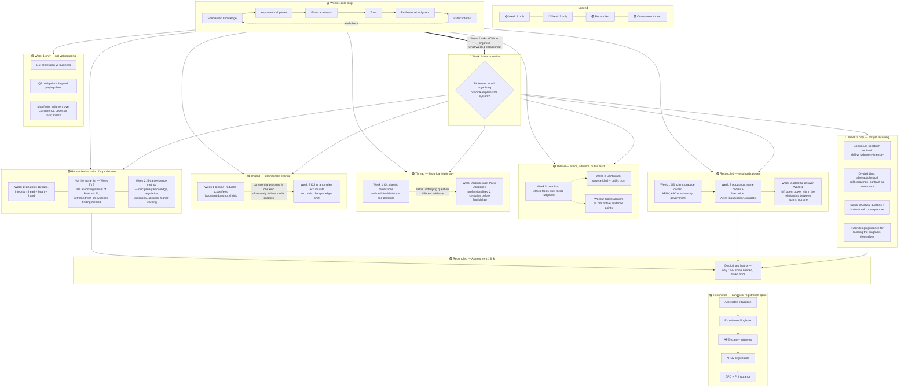

# 01 — Master map: cross-week synthesis (Weeks 1–2)

- **Purpose:** show real relationships between weekly diagrams — not a re-summary of either week
- **Scope:** everything already built in `05-diagrams/week-01/` and `05-diagrams/week-02/`
- **Rule:** this file never introduces a new claim that isn't already sourced in a weekly pack — it only draws the links between existing claims. If you want to trace a node back to its source, check that week's `04-topics-context.md` first.
- **Version:** v01 — rebuild after each new week using `02-concept-index.md`

## Legend

| Element | Meaning |
|---------|---------|
| 🟡 Week 1 only | Claim/cluster unique to Week 1 |
| 🔵 Week 2 only | Claim/cluster unique to Week 2 |
| 🟣 Reconciled | Same claim appeared in both weeks — merged into one node |
| 🟢 Thread | A concept that runs across weeks without being an exact duplicate |
| **→** solid | Primary flow |
| **- - →** dashed | Cross-week relationship |

---

## Diagram

---

## What this map is telling you

1. **You've been redrawing the registration spine every week.** It should exist once — this map treats it as the single canonical version. Both weekly packs still keep their own copy (per the scoping rule — each week must stand alone), but going forward, Assessment 1 work should pull from here, not from either week's copy.

2. **Week 2 isn't a new topic — it's Week 1's open question, operationalised.** Week 1 asked "who holds power?" and left it unresolved (Q3 just lists actors). Week 2's apparatus cluster is the direct continuation: same actors, plus a live class poll, plus an actual answer ("power sits in the relationship, not the actor"). That's a genuine argument you can make in Assessment 1 — the two weeks aren't separate content, they're steps in one argument.

3. **The traits lists don't actually match** — worth being precise about this in your matrix rather than treating "5 traits" and "11 traits" as interchangeable. Week 2's 5 are best read as a subset method for finding evidence, not a competing list.

4. **Two threads (legitimacy, strain) are structurally similar but evidentially different** — useful if Assessment 1 wants a "why does the profession need to keep justifying itself" argument, since you now have both a historical case (Sciulli) and a mechanism (Kuhn) to back it, plus your own in-class observation (commercial pressure) as a live example.

---

## Redraw note

This map will get harder to read past 3–4 weeks stacked in one diagram. See `README.md` in this folder for the plan on how synthesis scales.
