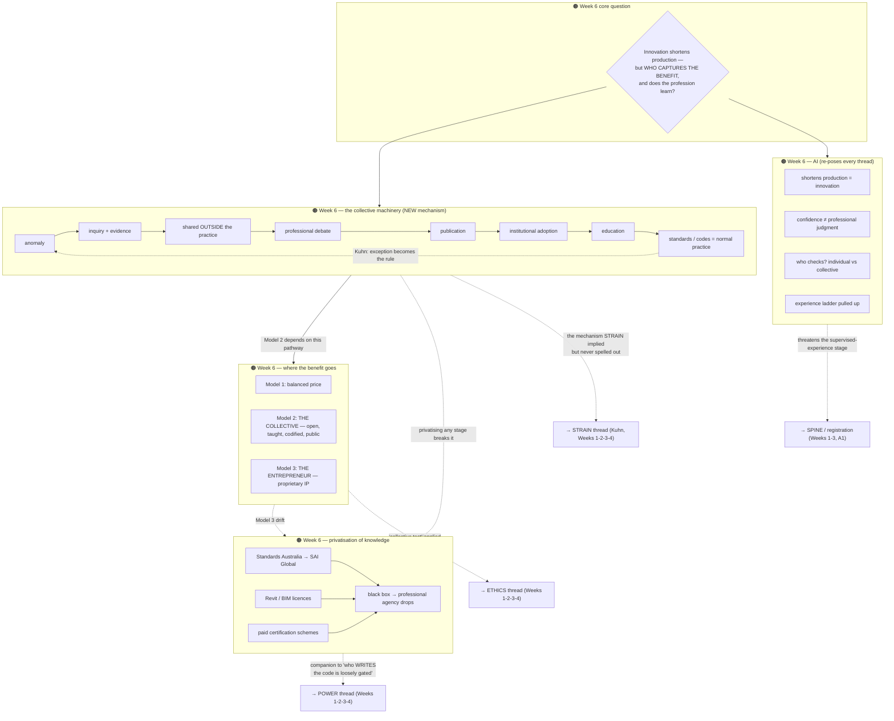

# 01 — Master map: cross-week synthesis (Weeks 1–4)

- **Purpose:** show real relationships between weekly diagrams — not a re-summary of any single week
- **Scope:** everything already built in `05-diagrams/week-01/`, `05-diagrams/week-02/`, `05-diagrams/week-03/`, `05-diagrams/week-04/`
- **Rule:** this file never introduces a new claim that isn't already sourced in a weekly pack — it only draws the links between existing claims. If you want to trace a node back to its source, check that week's `04-topics-context.md` first.
- **Version:** v04 — 2026-09-06. The Weeks 1–4 graph below is unchanged from v03; **Week 6 is added as an addendum section near the end**, not folded in, because the single-diagram approach has reached its split point (see "Redraw note"). Week 5 had no standalone pack. Next pass converts this file into an index over per-thread diagrams.
- **Zoning:** this map is the **temporal zoning** layer — each week (W1CORE/W2CORE/W3CORE/W4CORE) is its own zone, kept in its own native layout type (Week 1 = circular core loop, Week 2 = radial six-lens hub, Week 3 = linear history→mechanism spine, Week 4 = hierarchy/network hybrid) rather than forced into one shape. Threads/reconciled clusters are the cross-links connecting those zones. See `08-diagram-style/STYLE_GUIDE.md` "Composite layering" for the full method.

## Legend

| Element | Meaning |
|---------|---------|
| 🟡 Week 1 only | Claim/cluster unique to Week 1 |
| 🔵 Week 2 only | Claim/cluster unique to Week 2 |
| 🟠 Week 3 only | Claim/cluster unique to Week 3 |
| 🟣 Week 4 only | Claim/cluster unique to Week 4 |
| 🟪 Reconciled | Same claim appeared in more than one week — merged into one node |
| 🟢 Thread | A concept that runs across weeks without being an exact duplicate |
| **→** solid | Primary flow |
| **- - →** dashed | Cross-week relationship |
| **==>** bold | Week-to-week progression (this week operationalises the last) |

---

## Diagram

```mermaid
flowchart TB
  subgraph LEGEND["Legend"]
    direction LR
    LG1[🟡 Week 1 only] --- LG2[🔵 Week 2 only]
    LG2 --- LG3[🟠 Week 3 only]
    LG3 --- LG3b[🟣 Week 4 only]
    LG3b --- LG4[🟪 Reconciled]
    LG4 --- LG5[🟢 Cross-week thread]
  end

  subgraph W1CORE["🟡 Week 1 core loop"]
    direction LR
    W1K[Specialised knowledge] --> W1PWR[Asymmetrical power] --> W1ETH[Ethics + altruism] --> W1TR[Trust] --> W1JUD[Professional judgment] --> W1PUB[Public interest]
    W1PUB -.->|feeds back| W1K
  end

  subgraph W2CORE["🔵 Week 2 core question"]
    direction LR
    W2Q{Six lenses: which organising\nprinciple explains the system?}
  end

  subgraph W3CORE["🟠 Week 3 core question"]
    direction LR
    W3Q{"Why does the Act exist? —\ngives legal form to\nknowledge, authority, responsibility"}
  end

  subgraph W4CORE["🟣 Week 4 core question"]
    direction LR
    W4Q{"Loos 1910: no good or bad\narchitects, only degrees of the\nsame guilt — so what is the\nprofession's differentiation\nmachinery actually measuring?"}
  end

  W1CORE ==>|Week 2 asks HOW to organise\nwhat Week 1 established| W2CORE
  W2CORE ==>|Week 3 shows the actual\nlegal mechanism the organising\nframeworks were pointing at| W3CORE
  W3CORE ==>|Week 4 shows the reputational/\nmedia mechanism that decides who\ncounts as a GOOD registered\narchitect, not just who is one| W4CORE

  subgraph TRAITS["🟪 Reconciled — traits of a profession"]
    TR1[Week 1: Beaton's 11 traits,\nintegrity = head + heart + hand]
    TR2[Week 2: 5-trait evidence method\n— disciplinary knowledge, regulation,\nautonomy, altruism, higher learning]
    TR3[Not the same list — Week 2's 5\nare a working subset of Beaton's 11,\nreframed with an evidence-finding method]
    TR4[Week 3: traits become enforceable\nAct clauses — CPD, sign-off rule,\nconflict-of-interest disclosure,\nduty to resign a contract]
    TR1 --- TR3 --- TR2
    TR2 -->|Week 3 supplies the legal\nclause behind each trait| TR4
  end

  subgraph POWER["🟪 Reconciled — who holds power"]
    PW1[Week 1 Q3: client, practice owner,\nARBV, AACA, university, government]
    PW2[Week 2 Apparatus: same bodies +\nlive poll + Acts/Regs/Codes/Contracts]
    PW3[Week 2 adds the answer Week 1\nleft open: power sits in the\nrelationship between actors, not one]
    PW4[Week 3: explains WHY the apparatus\nhas this shape — Institute advances\nthe discipline, Board holds\naccountability; now fragmented further]
    PW5["Week 4: same apparatus, named in\nfull — AACA/ARBV/VBA/AQF/NSCA +\nOVGA/DELWP-VPA/ACCC/Fair Work —\nplus 'TheyRule' interlocking-\ndirectorate framing: a small,\noverlapping group sits across\nschools, Institute AND Board at once"]
    PW1 --> PW2 --> PW3
    PW3 -->|Week 3 explains the\nhistorical origin of this split| PW4
    PW4 -->|Week 4 names the apparatus\nin full and adds the\ninterlocking-leadership critique| PW5
  end

  subgraph ETHICS["🟢 Thread — ethics, altruism, public trust"]
    ET1[Week 1 core loop:\nethics feeds trust feeds judgment]
    ET2[Week 2 Continuum:\nservice ideal + public trust]
    ET3[Week 2 Traits: altruism\nas one of five evidence points]
    ET4["Week 3: legal teeth — conflict of\ninterest disclosure, duty to RESIGN\na contract rather than breach the\nAct, fire-isolated-stair case"]
    ET5["Week 4: reputational teeth — Bailey/\nShaw/Bruhn argue recognition itself\nshould serve public value, not\nmanufacture individual reputation\n('Architecture, not Architects')"]
    ET1 -.-> ET2
    ET1 -.-> ET3
    ET3 -.->|thread gets concrete\nlegal mechanism| ET4
    ET4 -.->|thread extends from\nregulatory duty to\nreputational/media duty| ET5
  end

  subgraph CLIENTROOM["🟪 Reconciled — RESOLVED — obligations beyond the paying client"]
    CR1[Week 1 Q2: future occupants,\nneighbours, community,\n\"client not in the room\"\n— left as an open question]
    CR2["Week 3: resolved — architect\n\"ultimately serves the public and\nnot just the paying client\"\n(fire-stair case, duty to withdraw)"]
    CR1 ==>|Week 1's open question\nanswered with an actual\nlegal mechanism| CR2
  end

  subgraph LEGIT["🟢 Thread — historical legitimacy"]
    LE1[Week 1 Q4: classic professions\nlaw/medicine/divinity vs neo-pressure]
    LE2[Week 2 Sciulli case: Paris Academie\nprofessionalised 2 centuries before\nEnglish law]
    LE3["Week 3: RIBA 1834/37 (advance\nknowledge, not license) + Australia's\nfragmented 1856-1929 founding +\nVic statutory registration 1922/23"]
    LE1 -.->|same underlying question,\ndifferent evidence| LE2
    LE2 -.->|third independent\nhistorical case| LE3
  end

  subgraph STRAIN["🟢 Thread — strain forces change"]
    ST1[Week 1 tension: reduced scope/fees,\njudgment does not shrink]
    ST2[Week 2 Kuhn: anomalies accumulate\ninto crisis, then paradigm shift]
    ST3["Week 3: NSW 2024-25 proposal to fold\nthe Architects Act into a Building\nBill — a live, current-events instance\nof the same pattern"]
    ST4["Week 4: 40 years of the profession's\nOWN critics (Bailey 1985 → Hyde 2011\n→ Stead 2024) naming the same\nrecognition-machinery problem,\nnever resolved — anomaly that\nnever tips into Kuhn's crisis stage"]
    ST1 -.->|commercial pressure is one kind\nof anomaly Kuhn's model predicts| ST2
    ST2 -.->|Kuhn's crisis stage,\nhappening in real time| ST3
    ST2 -.->|a second reading: an anomaly\nthat STAYS an anomaly, rather\nthan tipping into crisis| ST4
  end

  subgraph W1ONLY["🟡 Week 1 only — not yet recurring"]
    W1A[Q1: profession vs business]
    W1B[Manifesto: judgment over\ncompetency, codes as instruments]
  end

  subgraph W2ONLY["🔵 Week 2 only — not yet recurring"]
    W2A[Continuum spectrum mechanic:\nskill vs judgment-intensity]
    W2B[Divided Line: abstract/physical\nsplit, drawings+contract as instrument\n— reused directly in Week 4, see PW5]
    W2C[Sciulli structural qualities +\ninstitutional consequences]
    W2D[Tutor design guidance for\nbuilding the diagrams themselves]
  end

  subgraph W3ONLY["🟠 Week 3 only — not yet recurring, watch for Week 4+"]
    W3A["Institute vs Board — two connected\nbut distinct bodies (voluntary\nadvancement vs statutory accountability)"]
    W3B["Compliance culture / compliance\nmindset — regulation as an ongoing,\ncultivated mindset, not a one-off gate"]
    W3C["Molander et al.: discretion has a\nstructural side (the space) and an\nepistemic side (the reasoning) —\naccountability needs both kinds\nof measure"]
    W3A -.->|theory explains why\nboth kinds of body exist| W3C
    W3B -.->|compliance culture IS an\nepistemic accountability strategy| W3C
  end

  subgraph W4ONLY["🟣 Week 4 only — not yet recurring, watch for Week 5+"]
    W4A["Awards-as-machinery: categories\ndecide in advance what counts\n(typology, authorship) vs what stays\nperipheral (social benefit, maintenance,\nworking on country) — a RECOGNITION\nparallel to Week 3's REGULATION machinery"]
    W4B["Media ecosystem — six channels,\neach with its own gatekeeper and\nrisk; Bates Smart Award's own\n3-year swing (collective charter →\nindividual monograph → TikTok\nadvocacy) contains the whole tension"]
    W4C["The 'collective test': does this\nmake architecture more useful,\nequitable, publicly accountable — or\njust one architect more marketable?\nDirectly names housing, climate,\ncountry, labour conditions,\nPROCUREMENT, and public trust"]
    W4D["Fit-for-purpose vs performance\n(what architecture IS vs DOES) —\nexplicit forward pointer to next\nlecture's innovation/entrepreneurship\ntopic"]
    W4A -.->|both ask 'who decides what\ncounts as good,' just for\ndifferent instruments| W4B
    W4B -->|the sharpest single line\nin Week 4 — the test this\nweek's whole argument builds to| W4C
  end

  subgraph SPINE["🟪 Reconciled — canonical registration spine"]
    direction LR
    S1[Accredited education] --> S2[Experience / logbook] --> S3[APE exam + interview] --> S4[ARBV registration] --> S5[CPD + PI insurance]
  end

  subgraph W3REG["🟠 Week 3 — actual mechanism behind the spine"]
    direction LR
    R1[5 statutory requirements] --> R2[3 pathways — APE most common]
    R2 --> R3["APE: logbook/SOPE (3,300hrs) →\nNational Exam Paper → interview"]
  end

  subgraph A1["🟪 Reconciled — Assessment 1 link"]
    A1N[Disciplinary Matrix —\nonly ONE spine needed, drawn once]
    A1N --> S1
    A1M["Week 4 supplies a second usable\ntool for the Critical Position:\nthe 'collective test' — apply it to\nthe whole matrix, not just awards"]
    W4C -.->|reusable critical-position\ntool, not week-4-specific| A1M
    A1M --> A1N
  end

  W1CORE --> TRAITS
  W2CORE --> TRAITS
  W3CORE --> TRAITS
  W1CORE --> POWER
  W2CORE --> POWER
  W3CORE --> POWER
  W4CORE --> POWER
  W1CORE --> ETHICS
  W2CORE --> ETHICS
  W3CORE --> ETHICS
  W4CORE --> ETHICS
  ETHICS --> CLIENTROOM
  W1CORE --> LEGIT
  W2CORE --> LEGIT
  W3CORE --> LEGIT
  W1CORE --> STRAIN
  W2CORE --> STRAIN
  W3CORE --> STRAIN
  W4CORE --> STRAIN
  W1CORE --> W1ONLY
  W2CORE --> W2ONLY
  W3CORE --> W3ONLY
  W4CORE --> W4ONLY
  TRAITS --> A1N
  POWER --> A1N
  W2ONLY --> A1N
  W3REG -->|supplies the mechanism\nWeeks 1-2 only sketched| SPINE
  W3CORE --> W3REG
  W3ONLY -.->|explains why the ARBV system\nneeds BOTH the Tribunal AND\nCPD/the interview| W3REG
  W4ONLY --> A1M
```

---

## What this map is telling you

1. **Week 4 opens a second axis for Assessment 1, alongside registration.** Weeks 1–3 build toward *who is legally allowed to call themselves an architect* (the registration spine). Week 4 asks a genuinely different question: *who gets recognised as a good one, and by what machinery* (awards, journals, social platforms). Both are disciplinary-matrix material, and the diagram should show them as parallel systems, not the same one — one regulatory, one reputational.

2. **The POWER thread is now four weeks deep and essentially complete for Assessment 1 purposes.** Week 1 asked who holds power (open question); Week 2 answered that it sits in relationships, not single actors; Week 3 explained the historical split between Institute and Board; Week 4 names the full apparatus (adding VBA, OVGA, DELWP/VPA, ACCC, Fair Work) and adds the sharpest structural critique yet — a small, overlapping group of people sit across university leadership, the Institute, and the registration board simultaneously, echoing the "TheyRule" corporate-interlock visual. This is now the strongest, most detailed thread in the whole toolkit.

3. **ETHICS and STRAIN both extend cleanly into Week 4, but in different directions.** ETHICS gains a reputational dimension (public value in recognition, not just in regulation — Bailey/Shaw/Bruhn's "Architecture, not Architects" argument). STRAIN gains a second reading of Kuhn: Week 3's NSW repeal debate was an anomaly visibly *tipping into* crisis; Week 4's forty-year unresolved critique of the awards system is an anomaly that has stayed an anomaly, generation after generation, without ever tipping — worth naming as a genuinely different (and arguably more damning) pattern than Week 3's.

4. **Week 4 supplies the toolkit's first sourced mention of "procurement"** — one of Assessment 1's required topics that had no real evidence anywhere in Weeks 1–3. It appears only as a one-line mention (the lecturer's own list of what the profession risks neglecting), not a developed cluster — flagged in `02-concept-index.md` as a genuine gap requiring supplementary research for Assessment 1, not inflation of a single passing reference.

5. **Week 4's "collective test" is the most portable critical-position tool in the toolkit so far.** Unlike the week-specific theoretical lenses (Kuhn, Molander, Sciulli), the test — does this make architecture more useful, equitable, publicly accountable, or just more marketable/individually advantageous — applies cleanly to *every* cluster in the master map: registration, the Tribunal, CPD, awards, media, even the Divided Line's abstract/physical split. It is the strongest single candidate for the spine of Assessment 1's 150-word critical position.

---

## Week 6 addendum (v04 — 2026-09-06, not folded into the main graph)

Week 5 never got a standalone weekly pack (its pre-reading was pulled straight into Assessment 1). Week 6 is the next teaching week with a pack. At this point the single-diagram approach has hit the split trigger flagged since v02 — so Week 6 is added here as an addendum rather than re-tangled into the graph above. Next pass: split into per-thread files.



**What Week 6 adds to each existing thread:**

- **STRAIN** gets its missing middle: the 8-step collective machinery is *how* an anomaly is supposed to travel into normal practice. Week 3 (NSW Building Bill) and Week 4 (40-year awards anomaly) showed anomalies that do/don't tip; Week 6 shows the pathway they're meant to travel, and how privatisation blocks it.
- **ETHICS** gets *value capture*: Week 4's "collective test" applied to innovation — private (entrepreneur) vs shared (collective) benefit. "Sharing knowledge is not simply altruism, it is how architecture develops as a discipline."
- **POWER** gets *who owns the code*, not just who writes it: Standards Australia → SAI Global, rented BIM tools, the black box. Plus Easterling — standards *are* infrastructure, "the secret weapon of the most powerful."
- **SPINE / registration** is threatened by AI in two places: the supervised-experience stage (pulled-up ladder → unpaid internships) and the meaning of the APE (confidence vs judgment).

**Assessment 2 consumes this addendum directly** — see `05-diagrams/assessment-2/00-reengineering-from-a1.md`: the MAINTAIN/REFINE points defend the collective machinery + registration + ethics threads; the CHANGE points repair the privatisation, rule-making-opacity, procurement, AI-accountability and value-capture gaps.

**Also closes an Assessment 1 gap:** "research / innovation / entrepreneurship" was a required A1 topic with almost no sourced material in Weeks 1–4 (same situation as procurement). Week 6 supplies it; `02-assessment-tasks/ai-technology-research-note.md` supplements it with tagged independent research.

---

## Redraw note

**v04 (2026-09-06): the split trigger is reached.** At 4 weeks the map was still readable as one diagram, but density was climbing (POWER and the W4ONLY cluster were the largest). Week 6 has now been added as an addendum section (above) rather than folded into the main graph, because doing so would make the single diagram unreadable at a glance — exactly the Week 5–6 trigger the earlier redraw notes anticipated. Week 5 never got a standalone pack (its building-code pre-reading went straight into Assessment 1).

**Next synthesis pass should:** convert this file into a short index that points to per-thread diagrams — `power-thread.md` (Weeks 1–4 + Week 6 privatisation/Easterling), `ethics-thread.md` (Weeks 1–4 + Week 6 value capture), `strain-thread.md` (Weeks 1–4 + Week 6 collective machinery), `legit-thread.md` (Weeks 1–3), and a new `innovation-value-thread.md` (Week 6 + Assessment 2). Keep the Weeks 1–4 combined graph above as a historical snapshot; build new weeks onto the thread files, not onto it.
