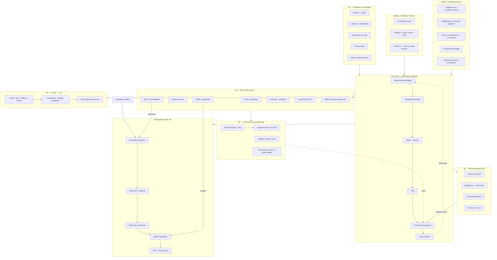

# EXPORT — Week 01 Diagram for Design Tool (Claude Design)

**Title:** Week 01 — What is a Profession?  
**Subtitle:** PP1 · Professional Practice 1 · v01  
**Canvas:** Landscape A3 or 1920×1080 · hybrid layout  
**Student:** S4097770 Kankawee Maksomboon  

---

## Design brief (paste this first)

Build a **hybrid information diagram** in the style of a Proprac practice-model map:

- **Centre:** large yellow circular loop (professional capacity cycle)
- **Left / top / right / bottom:** radial clusters for the 5 class questions
- **Bottom:** horizontal linear strip (Victoria registration pathway)
- **Short labels only** (3–8 words per node)
- **Legend box** top-right
- Clean grid background optional

---

## Color & shape system

| Code | Fill | Shape | Use for |
|------|------|-------|---------|
| YELLOW | `#FFD966` | Oval / pill | Main clusters + core loop nodes |
| WHITE | `#FFFFFF` | Rounded rectangle | Expansion detail |
| GREEN | `#93C47D` | Rounded rectangle | Beaton / theory / Assessment 1 |
| RED | `#E06666` | Rounded rectangle | Tension / conflict cluster |
| BLUE | `#6FA8DC` | Small pill | Transform / position label (optional) |

| Line | Style | Meaning |
|------|-------|---------|
| Primary | Solid black arrow | Main flow |
| Relationship | Dashed black arrow | Influence / related |
| Feedback | Dotted curved arrow | Loop back |
| Cross-link | Teal solid arrow | Assessment 1 connection |
| Limit | Red dashed arrow | Tension limits judgment |

---

## Layout regions (placement guide)

```
┌─────────────────────────────────────────────────────────────┐
│  LEGEND (top-right)          TITLE (top-centre)             │
├──────────────┬──────────────────────────┬───────────────────┤
│  Q1          │     Q3 — POWER           │  Q2 — OBLIGATIONS │
│  Profession  │                          │  Beyond client    │
│  vs Business │   ┌─────────────────┐    │                   │
│              │   │  CORE LOOP 🟡   │    │                   │
│  GREEN       │   │  knowledge →    │    │                   │
│  Beaton box  │   │  power → ethics │    │                   │
│              │   │  → trust →      │    │                   │
│              │   │  judgment →     │    │                   │
│              │   │  public interest│    │                   │
│              │   └─────────────────┘    │                   │
│  MANIFESTO   │     Q4 — CLASSIC ↔ NEO   │  Q5 — TENSION 🔴  │
│  (bottom-L)  │                          │  (bottom-R)       │
├──────────────┴──────────────────────────┴───────────────────┤
│  BOTTOM STRIP: Accredited edu → Logbook → APE → ARBV → CPD  │
│  GREEN: Disciplinary Matrix → links to strip start            │
└─────────────────────────────────────────────────────────────┘
```

---

## Nodes (copy into design tool)

### TITLE
- `TITLE` · **Week 01: What is a Profession?** · YELLOW header text

### CORE LOOP (centre — arrange in circle, clockwise)
| ID | Label | Color |
|----|-------|-------|
| K | Specialised knowledge | YELLOW |
| PWR | Asymmetrical power | YELLOW |
| ETH | Ethics + altruism | YELLOW |
| TR | Trust | YELLOW |
| JUD | Professional judgment | YELLOW |
| PUB | Public interest | YELLOW |

### Q1 — Profession vs business (upper-left)
| ID | Label | Color |
|----|-------|-------|
| Q1-H | Q1: Profession vs business | YELLOW |
| P1 | Altruism + ethics | WHITE |
| P2 | Learned + specialised | WHITE |
| P3 | Self-regulatory body | WHITE |
| B1 | Profit primary | WHITE |
| B2 | Market / member focus | WHITE |

### GREEN — Beaton / theory (left of core)
| ID | Label | Color |
|----|-------|-------|
| G-H | Beaton / Cheetham-Chivers | GREEN |
| G1 | 11 profession traits | GREEN |
| G2 | Integrity = head + heart + hand | GREEN |
| G3 | Profit OK — not if it trumps altruism | GREEN |

### Q2 — Beyond paying client (upper-right)
| ID | Label | Color |
|----|-------|-------|
| Q2-H | Q2: Beyond paying client | YELLOW |
| O1 | Future occupants | WHITE |
| O2 | Neighbours + community | WHITE |
| O3 | Future generations | WHITE |
| O4 | Client not in room | WHITE |

### Q3 — Who holds power? (top-centre / left of core)
| ID | Label | Color |
|----|-------|-------|
| Q3-H | Q3: Who holds power? | YELLOW |
| PW1 | Client / developer | WHITE |
| PW2 | Practice owners | WHITE |
| PW3 | ARBV / registration | WHITE |
| PW4 | AACA / accreditation | WHITE |
| PW5 | University + institutes | WHITE |
| PW6 | Government / NCC | WHITE |
| PW7 | ARBV absorption proposal? | WHITE |

### Q4 — Classic ↔ neo (lower-centre)
| ID | Label | Color |
|----|-------|-------|
| Q4-H | Q4: Classic ↔ neo | YELLOW |
| C1 | Classic: law · medicine · divinity | WHITE |
| C2 | Architecture = design profession | WHITE |
| C3 | Neo-profession pressure | WHITE |

### Q5 — Tension (lower-right)
| ID | Label | Color |
|----|-------|-------|
| Q5-H | Q5: Commercial vs professional | RED |
| T1 | Reduced scope + fees | WHITE |
| T2 | Judgment does not shrink | WHITE |
| T3 | Student: speed vs care | WHITE |
| T4 | Innovation for profit vs public benefit | WHITE |

### MANIFESTO themes (lower-left)
| ID | Label | Color |
|----|-------|-------|
| M-H | Week 1 manifesto themes | WHITE |
| M1 | Judgment over competency alone | WHITE |
| M2 | Registration = entrusted judgment | WHITE |
| M3 | Codes as instruments — not barriers | WHITE |
| M4 | Collective knowledge | WHITE |
| M5 | Measure by public contribution | WHITE |

### BOTTOM STRIP — Registration VIC (horizontal, left→right)
| ID | Label | Color |
|----|-------|-------|
| A1N | Disciplinary Matrix | GREEN |
| S1 | Accredited education | YELLOW |
| S2 | Experience / logbook | YELLOW |
| S3 | APE exam + interview | YELLOW |
| S4 | ARBV registration | YELLOW |
| S5 | CPD + PI insurance | YELLOW |

---

## Connections (all links)

| From | To | Line | Label on arrow |
|------|-----|------|----------------|
| K | PWR | solid | |
| PWR | ETH | solid | |
| ETH | TR | solid | |
| TR | JUD | solid | |
| JUD | PUB | solid | |
| PUB | K | dotted curved | feeds back |
| P1 | B1 | dashed | contrast |
| P2 | B2 | dashed | contrast |
| C1 | C2 | solid | |
| C2 | C3 | solid | |
| T1 | T2 | solid | |
| S1 | S2 | solid | |
| S2 | S3 | solid | |
| S3 | S4 | solid | |
| S4 | S5 | solid | |
| A1N | S1 | teal solid | A1 link |
| Q1-H | JUD | solid | informs |
| G-H | K | dashed | theory |
| Q2-H | JUD | dashed | depends upon |
| Q3-H | T5-H | dashed | influences |
| T5-H | JUD | red dashed | limits |
| MANIFESTO | JUD | dashed | supports |
| Q4-H | JUD | dashed | positions |
| JUD | S1 | dashed | leads to |
| PW3 | S4 | dashed | enables |
| PW4 | S1 | dashed | influences |

---

## Mermaid (machine-readable — paste if tool accepts Mermaid)



---

## Legend box text (paste into corner)

**Nodes:** Yellow = main · White = detail · Green = theory / A1 · Red = tension  

**Lines:** Solid = primary · Dashed = relationship · Dotted = feedback · Teal = A1 link  

---

## Export notes

- Source repo file: `05-diagrams/week-01/01-diagram.md`
- Hand-draw polish: match Proprac BAU/PRL style (yellow mains, white expansions, circular core)
- v02: add your blue label on classic ↔ neo position
