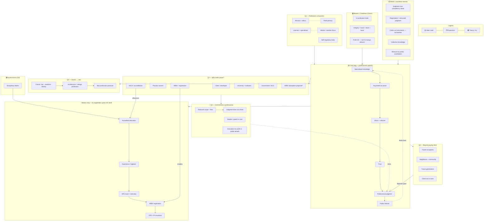

# 01 — Diagram: Week 01 — What is a Profession?

- **Week:** 01
- **Date:** 2026-07-26
- **Layout:** hybrid (circular core + radial clusters + bottom registration strip)
- **Style:** `08-diagram-style/` — short-form nodes, networked links
- **Sources scoped:** `03-weekly-resources/week-01/` only
- **Version:** v01

## Legend

| Element | Meaning |
|---------|---------|
| 🟡 Main / stage | Core topic or primary cluster |
| ⬜ Expansion | Short-form detail |
| 🟢 Integrated | Beaton / theory / Assessment 1 link |
| **→** solid | Primary flow |
| **- - →** dashed | Relationship / influence |
| **···→** dotted | Feedback loop |
| 🔴 accent | Tension / conflict |

---

## Diagram

---

## Primary links to say aloud

1. **Specialised knowledge → power → ethics** — Beaton: asymmetrical knowledge creates duty, not just expertise.  
2. **Professional judgment** — centre of Week 1 manifesto; not reducible to competency checklists alone.  
3. **Obligations beyond fee-payer** — future occupants and public are “clients not in the room.”  
4. **Power cluster** — clients and firms hold commercial power; ARBV/AACA hold regulatory power; tension when scope/fees cut but judgment expected.  
5. **Registration spine** — draft strip for Assessment 1; will be refined with exact gateways/times.  

---

## Redraw notes (v02)

- Hand-draw in Proprac yellow/white/green style when ready for class.  
- Add only verified ARBV/AACA timeframes from later weeks.  
- Mark your **position** on classic ↔ neo with one blue label.
