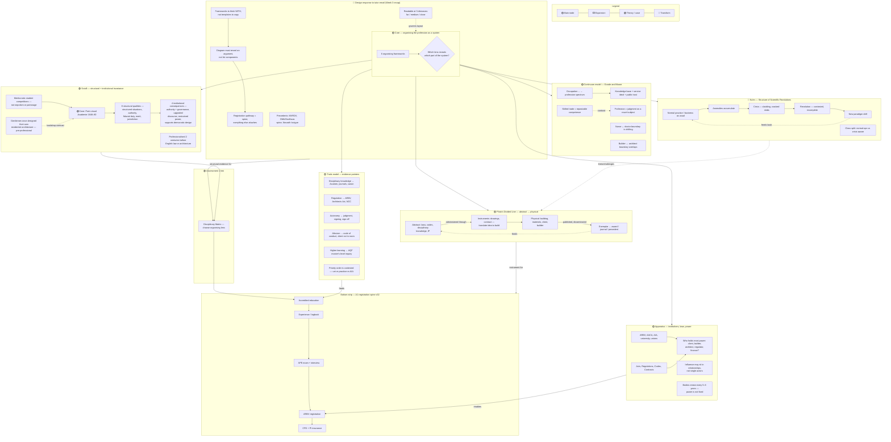

# 01 — Diagram: Week 02 — Models for Understanding a Profession

- **Week:** 02
- **Date:** 2026-08-02
- **Layout:** hybrid (radial frameworks core + branch clusters + bottom A1 spine)
- **Style:** `08-diagram-style/` — short-form nodes, networked links
- **Sources scoped:** `03-weekly-resources/week-02/` only
- **Version:** v01
- **Tutor design brief applied:** see "Design response to tutor email" below

## Legend

| Element | Meaning |
|---------|---------|
| 🟡 Main / stage | Core topic or primary cluster |
| ⬜ Expansion | Short-form detail |
| 🟢 Integrated | Sciulli theory / case study / Assessment 1 link |
| 🔵 Transform | Tutor design guidance shaping how the diagram itself is built |
| **→** solid | Primary flow |
| **- - →** dashed | Relationship / influence |
| **···→** dotted | Feedback loop |
| 🔴 accent | Tension / crisis / unresolved question |

---

## Diagram

---

## Primary links to say aloud

1. **Six frameworks, one question** — traits, continuum, apparatus, Kuhn, divided line, and Sciulli's invariance model all answer *"what organising principle explains the profession as a system?"* — that is this week's actual topic, per the tutor's Week 3 recap email.
2. **Continuum sharpens the traits model** — traits list *qualities*; the continuum asks *how much judgment vs repeatable competence* a role requires, which is what separates architect from draftsperson, doctor from nurse.
3. **Apparatus is where power actually sits** — not fixed in one actor; it moves between client, builder, regulator, and finance, and changes as institutional leadership renews.
4. **Kuhn explains *why* the profession should not stay static** — anomalies (cladding, cracked slabs) becoming crisis is the mechanism for paradigm change, not personal failure.
5. **Divided Line shows the architect's instruments** — drawings and contracts sit *on* the line, translating abstract knowledge into physical building; without them nothing can be built or valued.
6. **Sciulli's case (Paris visual Academie) is the closest historical parallel to architecture's own registration story** — a meritocratic, competition-based credentialing system built two centuries before English law professionalised.

---

## Design response to tutor email (Jack Stirling, "Welcome to Week 3")

This diagram deliberately implements the tutor's Week 3 preview email:

- **"Frameworks to think with, not templates to copy"** → each cluster above is used as a *lens*, not copied wholesale; the Sciulli case is worked through rather than just listed.
- **"Registration pathway should act as the spine"** → the bottom strip stays the organising spine; every framework cluster links back to it rather than floating independently.
- **Three reading distances** → far (six-framework radial core is legible as a shape), medium (cluster titles + primary links), close (expansion nodes + case study detail).
- **Precedents (MVRDV, OMA/Koolhaas, Neurath Isotype)** → informs the *next* hand-drawn iteration (v02): a single strong organising spine (Koolhaas-style "stack/section") with nested detail (Isotype-style legibility), not a flat list of boxes.

---

## Redraw notes (v02)

- Hand-draw with **one dominant spine** (registration pathway, Koolhaas-style) rather than six equal radial branches — tutor flagged flat lists as a risk.
- Test the diagram at arm's length — if the six-framework shape isn't legible without reading labels, simplify.
- Confirm the count of Sciulli's structural qualities against the source paper before finalising node count (this draft groups some together for space; the PDF itself lists eight separately — see `04-topics-context.md`).
- Consider dropping Traits and Continuum into one merged cluster in v02, since both largely restate the Week 1 argument — the tutor's recap treats Week 2 as "Conceptual Frameworks" (Kuhn, Divided Line, Apparatus, Sciulli), not a Week 1 repeat.
