# 01 — Diagram: Week 03 — The Architects Act, Registration & Compliance Culture

- **Week:** 03
- **Date:** 2026-08-10 (v02 — densified per tutor's "3 D's" Detail principle)
- **Layout:** hybrid, composite-layered (see `08-diagram-style/STYLE_GUIDE.md` "Composite layering") — left→right timeline + network + linear process + circular loop + top-down hierarchy, all cross-linked
- **Style:** `08-diagram-style/` — hybrid short-form nodes, networked links
- **Sources scoped:** `03-weekly-resources/week-03/` only
- **Version:** v02 — dump pass applied: every named person, body, date, clause, and mechanism the sources support is a node, not just the cluster-level summary. Every claim traces to `04-topics-context.md`.

## Legend

| Element | Meaning |
|---------|---------|
| 🟡 Main / stage | Core topic or primary cluster |
| ⬜ Expansion | Short-form detail / keyword node |
| 🟢 Integrated | Molander et al. (pre-reading) theory link |
| 🔵 Transform | Live tension / contemporary debate |
| **→** solid | Primary flow |
| **- - →** dashed | Relationship / influence |
| **···→** dotted | Feedback loop |
| 🔴 accent | Tension / unresolved question |

**Depth lenses applied this week** (see `08-diagram-style/STYLE_GUIDE.md` "3 D's"): HISTORY = historical lens; CLAUSES/COMPLY = professional/regulatory lens (default); duty-to-resign (C3) and public-vs-client framing (C7/C8/C13) = ethical lens.

**Layout type per zone** (see `08-diagram-style/STYLE_GUIDE.md` "Composite layering"): CORE = radial hub; HISTORY = left→right timeline; SPLIT = network; CLAUSES = list-network (trait ↔ clause); REG = linear process; COMPLY = circular loop; MOLANDER = top-down hierarchy; TENSION = linear. Cross-links between zones are relationship claims, not one uniform flow.

*Cross-**week** relationships (to Week 1/2) are intentionally not drawn here — this pack stays scoped to Week 3 sources only, per `weekly-diagram-pack.mdc`. See `05-diagrams/synthesis/01-master-map.md` for the 3-week version.*

---

## Diagram

```mermaid
flowchart TB
  classDef main fill:#F4D35E,color:#1a1a1a,stroke:#8a6c1f,stroke-width:1px;
  classDef theory fill:#8FBF8F,color:#1a1a1a,stroke:#3f5a3f,stroke-width:1px;
  classDef transform fill:#9EC1D9,color:#1a1a1a,stroke:#345070,stroke-width:1px;

  subgraph LEGEND["Legend"]
    direction LR
    L1[🟡 Main node] --- L2[⬜ Expansion / keyword]
    L2 --- L3[🟢 Theory link]
    L3 --- L4[🔵 Live tension]
  end

  subgraph CORE["🟡 Core — why does the Architects Act exist?"]
    direction LR
    Q{"Not just consumer protection —\ngives legal form to knowledge,\nauthority & responsibility"}
  end
  class Q main

  subgraph HISTORY["🟡 History — pre-registration → statutory registration [timeline]"]
    direction LR
    H1[Master builders, patrons,\napprenticeships — no register]
    H1a[Authority from reputation,\npatronage, workshop training]
    H2[RIBA founded 1834,\nroyal charter 1837 —\nADVANCE knowledge, not license]
    H2a["Charter: 'general advancement\nof Civil Architecture'"]
    H2b["RIBA motto: 'for the use of\nthe people, for the glory\nor ornament of the city'"]
    H2c[Francis Bacon's Carnel image —\nknowledge travelling beyond\nboundaries]
    H3[Silver Medal 1836 —\nGeorge Goodwin, essay on\nconcrete, not a building]
    H3a[RIBA Library, Burlington House —\ncollective knowledge archive]
    H4[Australia fragmented:\nVic 1856, NSW 1871,\nnational AIA not til 1929]
    H4a[J.M. Freeland: early profession\ninstitutionally uneven —\nrivalries, unstable membership]
    H5[Vic statutory registration\n1922/23 — debated from 1887,\npublic board, authority\nfrom parliament]
    H6[Only 12 of first 33\nregistrants were RVIA\nmembers]
    H1 --> H1a --> H2
    H2 --> H2a
    H2 --> H2b
    H2 --> H2c
    H2 --> H3 --> H3a
    H2 --> H4 --> H4a
    H4 --> H5 --> H6
  end
  class H2,H5 main

  subgraph SPLIT["🟡 Institute vs Board — connected but distinct [network]"]
    S1[AIA — voluntary,\nadvances discipline]
    S1a["AIA Code of Professional\nConduct (adopted 2006,\ncurrent as at July 2017)"]
    S2[ARBV — statutory,\npublic accountability,\nminimum standard]
    S3[Institute enables architects\nto act together]
    S4[Act enables society to\nhold architects accountable]
    S5[Contrast: medicine's\nCollege of GPs\ncollapses both into one]
    S6a[ArchiTeam — small-practice\ncollective, shared insurance]
    S6b[Architects Declare Australia —\nvoluntary ethical mobilisation,\nclimate/biodiversity]
    S6c[AASA — Association of\nArchitecture Schools of\nAustralasia, pre-reg knowledge]
    S6d["Parlour — gender equity guides.\nOnly 21% registered architects\nare women vs ~40% of graduates"]
    S6e[ACA — Australian Consulting\nArchitects: business, procurement,\nemployment conditions]
    S6f[AACA — National Standard of\nCompetency, coordinates\nstate/territory boards]
    S7a["International: national regulation —\nAustralia, Canada, Germany,\nUS via NCARB (state-based)"]
    S7b[International: voluntary —\nDenmark, Sweden, Finland]
    S7c["India: Council of Architecture\n(statutory register) + Indian\nInstitute of Architects (assoc.)\n— mirrors Australia's split"]
    S8[Peggy Deamer critique: US\nlicensure regulates entry, not\nwages/hours/insecure employment]
    S1 --> S3
    S1 --> S1a
    S2 --> S4
    S1 -.->|contrast| S2
    S5 -.->|counter-model| S2
    S6a & S6b & S6c & S6d & S6e -.->|fill gaps AIA\ncan't cover alone| S1
    S6f -.->|coordinates| S2
    S7a -.->|parallel model| S2
    S7c -.->|parallel model| S1
    S7c -.->|parallel model| S2
    S7b -.->|contrast — no\nstatutory board| S2
    S8 -.->|critiques| S7a
  end
  class S1,S2 main

  subgraph CLAUSES["🟡 Act clauses mapped to professional traits [list-network]"]
    C9["Purpose of Act: regulate conduct,\nhandle complaints, regulate the\nterm 'architect'/'architectural\nservices'/'design'"]
    C10[Professional indemnity +\npublic liability insurance\nrequired]
    C1[Disciplinary knowledge →\nCPD, thorough knowledge\nmandated only ~2022]
    C2[Autonomy → can't sign/approve\nwork not actually done]
    C3[Altruism → must resign contract\nrather than breach Act]
    C4[Altruism → conflicts of interest\nmust be declared, e.g. ownership\nin construction tech]
    C5[Higher learning → board sets\nqualifications, exams,\naccredited courses, examiners]
    C6[Individual + collective →\ngood character, consistency\nwith other architects]
    C11[Can't misrepresent involvement\nor authorship in a project]
    C7[Duty to engender confidence\nand respect for the profession]
    C12[Public trust — Tribunal may\ndirect public inquiry; discipline\nregister publicly accessible]
    C13[Public good — Tribunal for\ncareless, incompetent or\nunprofessional conduct]
    C8[Case: fire-isolated stair —\narchitect must refuse\nnon-compliant instruction]
    C9 --> C10
    C3 --> C8
    C7 -.->|owed to PUBLIC,\nnot just paying client| C8
    C12 -.->|enforces| C13
    C13 -.->|enforces| C3
    C11 -.->|same clause family| C6
  end
  class C3,C7 main

  subgraph REG["🟡 Registration spine — the APE [linear process]"]
    direction LR
    R1[5 requirements: fit & proper ·\nprescribed study · 2yrs practice ·\nPII insurance · fees]
    R1a["'Fit and proper' = probity test\n(criminal history, insolvency) —\nNOT physical fitness. Must\ndisclose upfront"]
    R6a[2 classes: practising ·\nnon-practising]
    R2[3 pathways: APE ·\nExperienced Practitioner\nAssessment · Mutual Recognition]
    R2a["EPA: competency/portfolio-based,\nhard to meet — for overseas-\nregistered or decades-experienced"]
    R2b[Mutual Recognition: equivalent\ninterstate/overseas registration\nbypasses re-proving experience]
    R3[APE Part 1: Logbook + SOPE —\n3,300 hrs, 35 performance criteria]
    R3a["4 PC categories: Practice Mgmt &\nProfessional Conduct · Project\nInitiation & Conceptual Design ·\nDetailed Design & Construction\nDocumentation · Design Delivery &\nConstruction Phase Services"]
    R3b["SOPE: 2,000-3,000 words, ~4\nprojects typical — summary CV +\nPC report excluded from count"]
    R3c["Max 1,650 hrs loggable\npre-graduation; same cap for\noverseas hours + min 12 months\nAustralian post-grad required"]
    R4[APE Part 2: National Exam Paper —\n120min, 80 MCQ, closed book,\nNCC-focused]
    R5[APE Part 3: Interview —\n45-60min, probes gaps via\nhypotheticals]
    R5a["Tip: build breadth across\nperformance criteria — not\nyour 'coolest' project"]
    R6[Still must apply for\nregistration after passing]
    R1 --> R1a
    R1 --> R6a
    R1 --> R2
    R2 --> R2a
    R2 --> R2b
    R2 --> R3
    R3 --> R3a
    R3 --> R3b
    R3 --> R3c
    R3 --> R4 --> R5
    R5 --> R5a
    R5 --> R6
  end
  class R3,R4,R5 main

  subgraph COMPLY["🟡 Compliance culture — regulation as ongoing mindset [circular loop]"]
    CU1a[ARBV/NSW ARB systemic\nrisk reports 2022, 2024]
    CU1b[Cladding Safety Victoria\nreports 2024]
    CU1c[Shergold-Weir Building\nConfidence Report 2018]
    CU1d[Financial Services Royal\nCommission — Commissioner\nHayne, 2019]
    CU8["3 outputs: detailed report ·\n1-page summary · practical\nguidance booklet (top-10\nstrategies, sole/small vs large)"]
    CU2[Compliance culture =\nshared values/attitudes/habits\nguiding behaviour]
    CU3[Compliance mindset =\nindividual's internalised\ncommitment, even unwatched]
    CU3a["5 elements: commitment to\nlearning · thorough understanding\nof obligations · acceptance of\nresponsibility · vigilance ·\ncommitment to compliant pathway"]
    CU9["Professionalism's 5 attributes:\nspecialised knowledge · service to\nothers · collaboration + discretion ·\nhigh standards · legal/ethical\ncompliance expected"]
    CU4a[1. Duty of care]
    CU4b[2. Duty of competence]
    CU4c[3. Honesty & integrity]
    CU4d[4. Comply with all\napplicable laws]
    CU4e[5. Confidentiality]
    CU4f[6. Impartiality, avoid\nconflicts of interest]
    CU4g[7. Records & effective\ncommunication]
    CU5[Owed to 3 groups:\nclients · public · profession]
    CU6[Applied at 4 levels:\nindividual · firm ·\nproject · sectoral]
    CU7[Ripple effect: identity →\nduties → culture →\npositive outcomes]
    CU1a & CU1b & CU1c & CU1d --> CU8 --> CU2
    CU2 <-.->|virtuous cycle| CU3
    CU3 --> CU3a
    CU9 -.->|aligns naturally with| CU3
    CU4a & CU4b & CU4c & CU4d & CU4e & CU4f & CU4g --> CU5
    CU4a & CU4b & CU4c & CU4d & CU4e & CU4f & CU4g --> CU6
    CU3 --> CU7
  end
  class CU2,CU3,CU7 main

  subgraph MOLANDER["🟢 Molander et al. — discretion & accountability [hierarchy]"]
    M1[Discretion = structural\nspace to judge +\nepistemic reasoning\nunder uncertainty]
    M6["Norwegian GP case study: 360 GPs,\nwide variation in disability-pension\njudgments, correlated with\npersonal values"]
    M2["Two tensions: discretion vs\nrule of law · discretion vs\ndemocratic control (Rothstein's\n'democracy's black hole')"]
    M3[Accountability = duty to\njustify to those with a\nright to demand it]
    M4[Structural measures:\nconstrain the space —\nregistration, Tribunal]
    M5a[Formative — education, CPD]
    M5b[Supportive — evidence-based\npractice, decision-support systems]
    M5c["Motivational — incentives,\nnudge (Thaler & Sunstein);\nrisk: 'gaming' / multi-task problem"]
    M5d["Deliberative (narrow) —\ncollegial bodies, court-like\ninstitutions e.g. the Tribunal"]
    M5e["Deliberative (wide) —\npublic sphere, deliberative\npolling (Fishkin)"]
    M5f[Participatory — co-decision\nprocedures with affected parties]
    M1 --> M6
    M1 --> M2
    M1 --> M3
    M3 --> M4
    M3 --> M5a & M5b & M5c & M5d & M5e & M5f
  end
  class M1,M2,M3,M4,M5a,M5b,M5c,M5d,M5e,M5f theory

  subgraph TENSION["🔵 Live tension — does the Act's form matter? [linear]"]
    T1[NSW 2024-25: proposal to fold\nArchitects Act into\nBuilding Bill]
    T1a["Adam Haddow's key objectives:\nuphold 'lift and shift' intent ·\nmaintain registration · protect\nSEPP65 design controls\n(3+ storey, 4+ dwelling)"]
    T2[Risk of losing registration/\nprofessional standards\nprotections]
    T3[Real question: do mechanisms\n& public purpose survive,\nnot just the standalone document]
    T1 --> T1a --> T2 --> T3
  end
  class T1,T2,T3 transform

  CORE --> HISTORY
  HISTORY --> SPLIT
  SPLIT --> CLAUSES
  CLAUSES --> REG
  REG -->|passed APE, now registered| COMPLY
  M4 -.->|explains why| REG
  M4 -.->|explains why| S2
  M5a -.->|explains why| C1
  M5d -.->|explains why| R5
  M5d -.->|explains why| C12
  M5c -.->|explains why| S6a
  CU4d -.->|codifies| C9
  CU4a -.->|codifies| C3
  CU4f -.->|codifies| C4
  COMPLY -->|tests whether mechanisms\nsurvive form changes| TENSION
  M2 -.->|underlies| TENSION
  S2 -.->|body being tested| T2
  TENSION -.->|feeds back into| CORE
```

---

## Primary links to say aloud

1. **History spine explains the founding logic** — RIBA (1834/37) was about advancing *knowledge*, not licensing (its 1836 Silver Medal went to an essay on concrete, not a building); statutory registration (Victoria, debated from 1887, enacted 1922/23) was a *separate*, later invention — proven by only 12 of the first 33 registrants being institute members.
2. **Institute and Board stay connected but distinct, and the network keeps growing** — AIA lets architects act together; ARBV lets society hold them accountable. Architecture has since fragmented into ArchiTeam, Architects Declare, AASA, Parlour, and the ACA, each covering something the AIA alone doesn't — and the same institute/board split shows up internationally (India's Council of Architecture vs Indian Institute of Architects).
3. **Every Act clause is a trait made enforceable** — disciplinary knowledge → CPD; autonomy → sign-off rules; altruism → conflict-of-interest declarations and the duty to *resign* a contract; and the Act's stated purpose is explicit: regulate conduct, handle complaints, regulate who can use the term "architect" at all.
4. **The APE is dense on purpose — 5 requirements, 3 pathways, 3 exam parts, each with their own sub-rules** (probity test, hour caps, 4 performance-criteria categories, word counts) — this is the literal mechanism most students in the room are about to go through.
5. **Compliance culture reframes the whole system as ongoing, not a one-off gate** — 4 catalyst reports feed 3 outputs, which sit on top of 7 individually enumerated overarching duties, owed to 3 groups, at 4 levels.
6. **Molander's structural/epistemic split has 5 named subtypes, each mapping to a real ARBV mechanism** — formative (CPD), supportive (evidence-based practice), motivational (incentive schemes — and their failure mode, "gaming"), deliberative narrow (the Tribunal), deliberative wide (public discipline register), participatory (co-decision).
7. **The NSW repeal debate is a live, detailed test of the whole diagram** — Adam Haddow's specific objectives (registration, SEPP65 design controls) show exactly which mechanisms are at stake if the Act's form changes.

---

## Redraw notes (v02)

- This version deliberately favours **more atomic nodes over clean simplicity** — per tutor guidance (dump pass, Detail principle) and to keep the diagram legible at close range as well as from a distance, not just tidy.
- Hand-draw with the history timeline and registration spine as two parallel horizontal strips (left→right), with the compliance-culture radial cluster and Molander's hierarchy sitting above/between them.
- Verify the exact Victorian registration year (1922 vs 1923 — recording states both) against the Act's own history notes before finalising a single date on the hand-drawn version.
- If this reads as too dense for a single hand-drawn sheet, split by natural seam: **History + Institutional structure** (one sheet) vs **Act clauses + Registration + Compliance + Molander + Tension** (a second sheet) — both still trace back to one core question.
