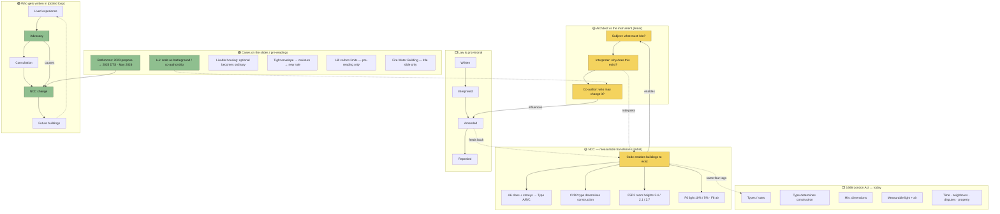

# 01 — Diagram: Week 05 — Architecture and the Instruments of Law

- **Week:** 05
- **Date:** 2026-08-23
- **Layout:** hybrid — linear three-role spine + radial NCC cluster + left→right 1666 parallel + dotted amendment loop
- **Style:** `08-diagram-style/` (short-form nodes + networked links)
- **Sources scoped:** `03-weekly-resources/week-05/` and lecture slides captured in `02-assessment-tasks/assessment-1-development/week-05-contents.md` (no recording in the repo)

## Legend

| Element | Meaning |
|---------|---------|
| Yellow | Main / stage node |
| White | Expansion (short-form) |
| Green | Assessment 1 / named reading |
| Solid → | Primary flow |
| Dashed - - → | Relationship |
| Dotted ···→ | Feedback / amendment |

**Layout type per zone:** ROLES = linear; NCC = radial; 1666 = timeline parallel; WHO = dotted loop. Cross-links are relationship claims.

---

## Diagram

## Key links to say aloud

1. The NCC **enables** buildings to exist — it is not a neutral manual.
2. Advocacy **influences** / **causes** amendment (lived path → NCC change).
3. A new energy rule **causes** a moisture problem — then another rule answers it.
4. The architect moves from **subject** to **interpreter** to **co-author**.

## Version

- v01 — first network from Week 5 slides + pre-reading URLs (2026-08-23)
