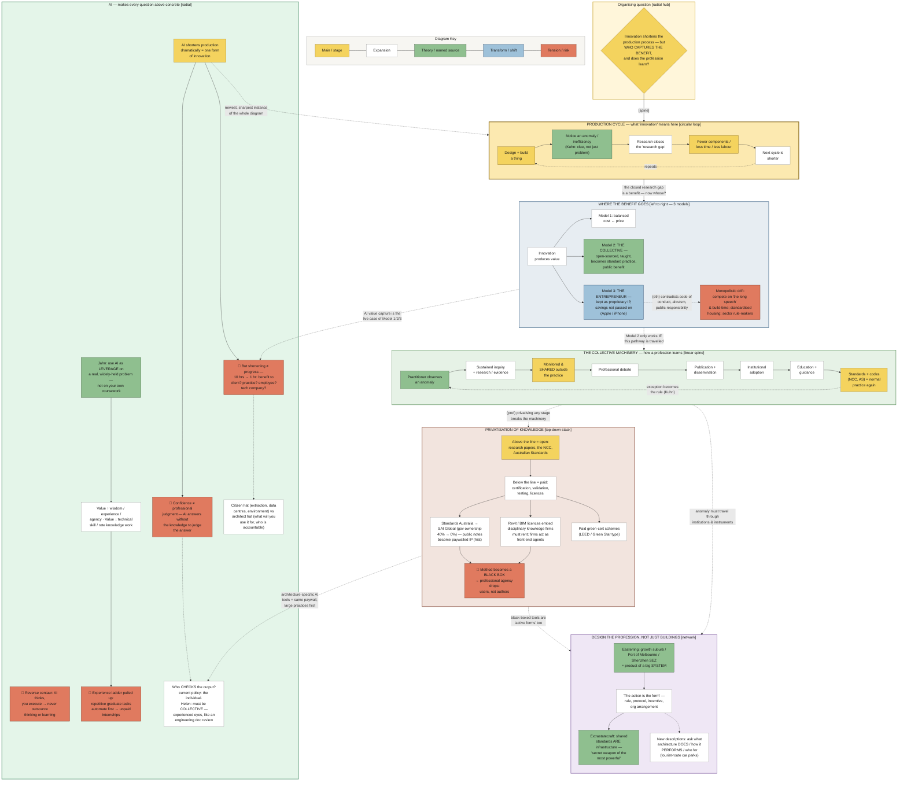

# 01 — Diagram: Week 06 — The Entrepreneur + The Collective (Innovation, Value, AI)

- **Week:** 06
- **Date:** 2026-09-06
- **Layout:** hybrid / composite-layered (see `08-diagram-style/STYLE_GUIDE.md`) — a central **production-cycle loop**, a left→right **"where the benefit goes"** split, a linear **collective machinery** spine, a top-down **privatisation** stack, and an **AI** cluster that re-poses every other cluster's question. Cross-links are relationship claims, not one flow.
- **Style:** `08-diagram-style/` — short-form nodes, networked links, legend on the diagram
- **Sources scoped:** `03-weekly-resources/week-06/` only (Helen's lecture, Gwyl Jahn's lecture + Q&A, `links.md`). No other week is linked here — that is the synthesis layer's job.

## Legend

| Element | Meaning |
|---------|---------|
| 🟡 Main / stage node | Core topic or primary cluster |
| ⬜ Expansion | Short-form detail |
| 🟢 Theory / named source | Kuhn, Easterling, Badiou, Jahn, a named case |
| 🔵 Transform / shift | A change from one model or condition to another |
| 🔴 accent | Tension / conflict / risk (use sparingly) |
| **→** solid | Primary flow (enables / depends upon) |
| **- - →** dashed | Relationship / influence (limits / causes) |
| **···→** dotted | Feedback loop |
| lens tags | `(eth)` ethical · `(prof)` professional/regulatory · `(hist)` historical — inline, not a colour |

## Diagram

## Key links to say aloud

1. **The production cycle *is* the definition of innovation** — every loop closes a "research gap" and the next loop is shorter. That's neutral engineering until you ask the next question.
2. **"Where the benefit goes" is the whole lecture in one split** — the same innovation can flow to a balanced price, to the profession and public (the collective), or to proprietary IP (the entrepreneur). Only the third contradicts the code of conduct.
3. **The collective model is not automatic — it *depends upon* the machinery spine being travelled** (anomaly → shared outside the practice → debate → publication → adoption → education → codes). Privatising any stage of that spine *limits* the profession's ability to learn.
4. **Easterling reframes "design"** — the rule, the standard, the contract, the incentive are "active forms." A black-boxed tool is one of them, working on you.
5. **AI is drawn last on purpose — it re-poses every other cluster's question in the present tense.** It shortens production (cycle), so who captures the 10-hours-to-1-hour benefit (where the benefit goes)? It answers without the knowledge to judge the answer (confidence ≠ judgment). And who checks it — the individual, or the collective?
6. **Direction / the "so what":** the profession has a working machinery for turning private discovery into shared knowledge, and it is being quietly disabled — by privatised standards, by rented tools, and now by AI whose value capture and accountability default to the individual and the platform. *A manifesto's job is to say which parts of that machinery to defend and which to rebuild.*

## Version

- **v01 (2026-09-06)** — first network of Week 6's key features, refined pass (Detail dump then Density cut). Kept: production cycle, 3 benefit models, collective machinery spine, privatisation stack, Easterling systems cluster, AI cluster. Moved to `02-explanation.md`: the de l'Orme woodcut detail, the Kuhn condensation-failure worked example, the Badiou material, and the Jahn "how to benefit in an AI world" list. Flagged for the hand-drawn version: draw the AI cluster literally *overlapping* the other five so it reads as "the same questions, now."
