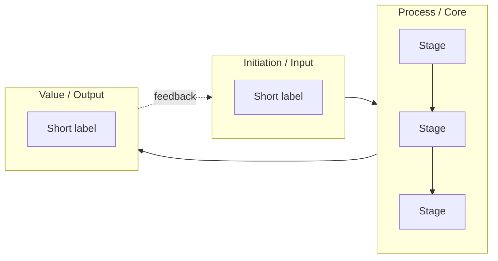

# 01 — Diagram: Week XX — [Topic]

- **Week:** XX
- **Date:** YYYY-MM-DD
- **Layout:** hybrid / circular / mindmap / timeline / top-down / left-right
- **Style:** `08-diagram-style/` (short-form nodes + networked links)
- **Sources scoped:** `03-weekly-resources/week-XX/`

## Legend

| Element | Meaning |
|---------|---------|
| Yellow | Main / stage node |
| White | Expansion (short-form) |
| Green | Assessment 1 / theory integrate |
| Solid → | Primary flow |
| Dashed - - → | Relationship |
| Dotted ···→ | Feedback |

## Diagram

## Key links to say aloud

1. … **enables** …
2. … **limits** …
3. … **feeds back into** …

## Version

- v01 — first network of week’s key features
- (add v02 notes when redrawn)
