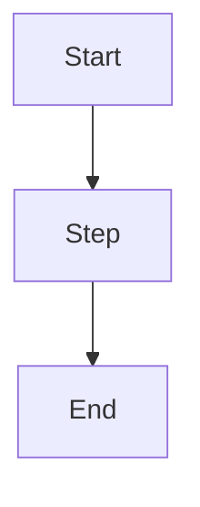

# Diagram: [Title]

- **Purpose:** (one sentence)
- **Source(s):** `path/to/resource`
- **Date:** YYYY-MM-DD
- **Type:** flowchart / sequence / mindmap / timeline / other

## Diagram

## How to read this

1. 
2. 

## Notes / assumptions

- 
